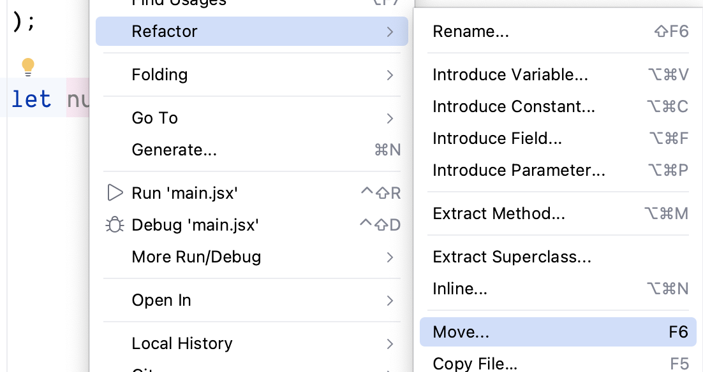
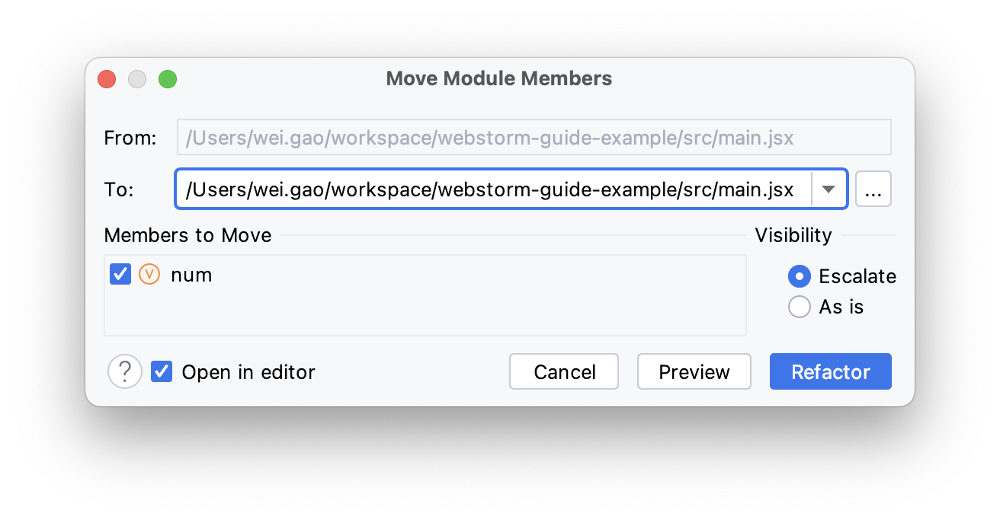
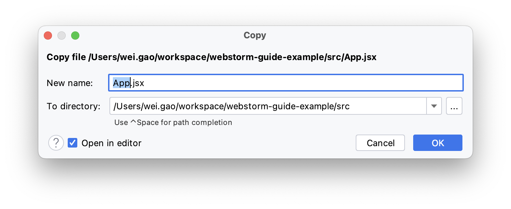
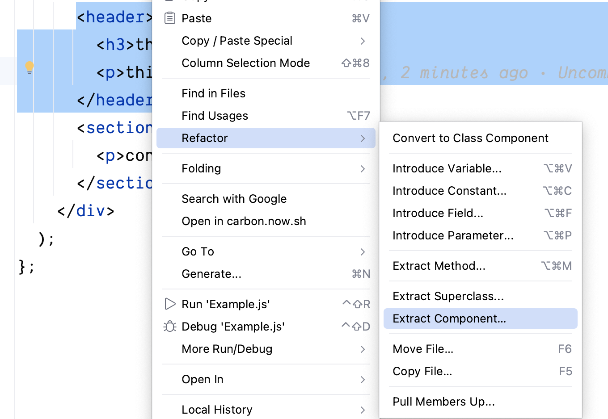
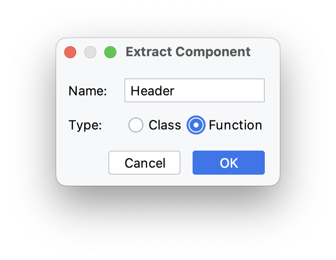
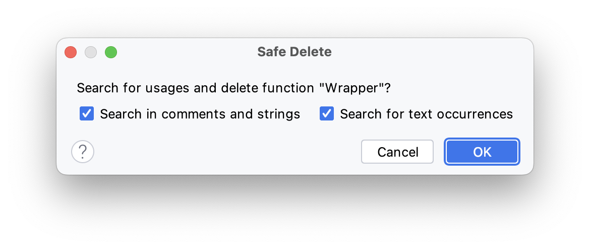
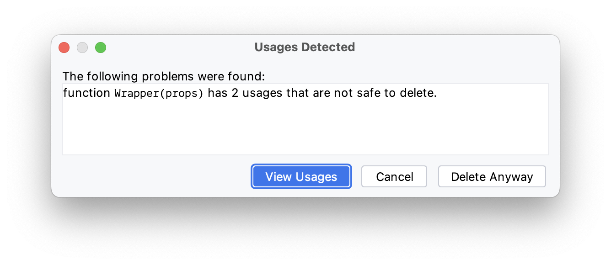
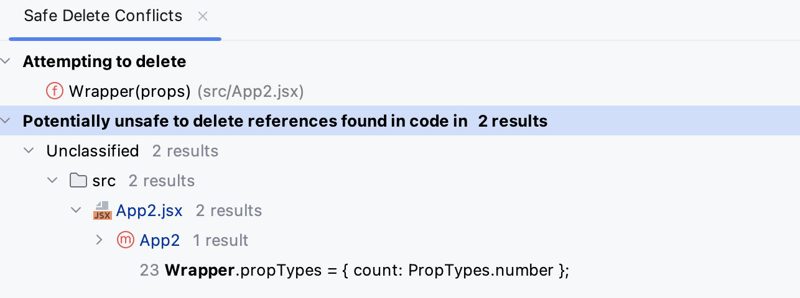

WebStorm 的一大亮点功能就是**重构**

重构是一种对软件内部结构的改善，目的是在不改变软件的可见行为的情况下，使其更易理解，修改成本更低，其中，“重构不改变外部的可见行为”，可以把重构理解为，在保持功能不变的前提下，利用设计思想、原则、模式、编程规范等理论来优化代码，修改设计的不足，提高代码质量

实现重构的方法有很多，比如有

- 方法提取
- 变量命名语义化、业务化

而 WebStorm 支持重构自动化，开发人员只需要选中需要重构的代码执行对应的重构方法即可完成重构。WebStorm 将重构的工作变的简单、高效。
下面是 WebStorm 支持的主要重构方法

## 重命名

重命名指修改变量名、类名和文件名

## 更改签名

重构更改函数名称，添加，删除，重新排序和重命名参数，以及通过调用层次结构传递新参数

使用`更改签名`功能前

```js
function result() {}

function show_result() {
  alert("Result: " + result())
}
```

使用`更改签名`功能后

```js
function generate_result(input) {}

function show_result() {
  alert("Result: " + generate_result(100))
}
```

## 移动

移动是将选中的变量或方法从一个文件移动到另一个文件里。前提是同类型的文件，比如`.ts` 中的变量不能移动到 `.js` 的文件里

比如要将 `main.jsx` 文件里的 `let num = 10` 移动到 `App.jsx` 里



光标移动到 `num` 变量上，点击鼠标右键，选择 `Refactor` 选项，再选择 `Move...` 选项，显示 `Move Modules Members` 弹窗



选择对应的文件，点击 `Refactor` 按钮，即可将 `let num = 10` 移动到 `App.jsx` 里

## 拷贝文件

复制文件是拷贝选中的文件

选择 `Copy File...` 选项，显示 `Copy` 弹框



重新对文件命名，选择拷贝后文件的位置，然后点击 `OK` 按钮，完成文件拷贝

除此之外，开发人员可以直接使用 `command + c/v` 复制粘贴文件

## 引入变量

引入变量是将字符串值替换成变量并替换所有使用该字符串的位置 (类似软编码)

比如，现在有这样的一段代码

```js
console.log("WebStorm 使用指南")
```

`console.log` 方法直接输出一段文本，但是我们希望`console.log` 方法接收的参数是变量，变量的值是文本。那么可以使用`引入变量`功能实现

光标选中文本，点击鼠标右键，显示上下文操作菜单，选择 `Refactor`操作， 再选择 `Intruduce Variable...` 选项，结果如下

```js
const message = "WebStorm 使用指南"
console.log(message)
```

## 引入常量

引入常量是将内容替换成常量并替换所有使用该内容的位置。与引入变量的功能差不多

光标选中内容，点击鼠标右键，显示上下文操作菜单，选择 `Refactor` 操作， 再选择 `Intruduce Constants...` 选项。例子如下

使用 `引入常量` 功能前

```js
function calcPerimeter(diameter) {
  return diameter * 3.14
}
```

使用 `引入常量` 功能后

```js
function calcPerimeter(diameter) {
  const PI = 3.14

  return diameter * PI
}
```

## 引入字段

<el-alert 
title='引入字段仅在类中可用'
type='warning'
effect='dark'
:closable='false'
show-icon>
</el-alert>

引入字段声明了一个新字段并使用选定的表达式对其进行初始化。原始表达式被替换为字段的用法。

使用`引入字段`功能前

```js
class Rectangle {
  constructor(height, width) {
    this.height = height
    this.width = width
  }

  get area() {
    return this.calcArea()
  }

  calcArea() {
    return this.height * this.width
  }
}
```

使用`引入字段`功能后

```js
class Rectangle {
  constructor(height, width) {
    this.height = height
    this.width = width
  }

  _calcArea

  get area() {
    this._calcArea = this.calcArea()
    return this._calcArea
  }

  calcArea() {
    return this.height * this.width
  }
}
```

## 引入函数参数

## 提取方法

提取方法是将一段代码逻辑封装成新方法

使用 `提取方法` 功能前

```js
for (let i = 0; i < 10; i++) {
  console.log(i)
}
```

使用 `提取方法` 功能后

```js
function extracted() {
  for (let i = 0; i < 10; i++) {
    console.log(i)
  }
}

extracted()
```

## 提取组件

提取组件常用在 `React` 项目中，将 `render` 方法里的 `JSX` 片段提取到新 `react` 组件中。
下面以 `Article` 组件详细讲述`提取组件`功能

```jsx
const Article = () => {
  return (
    <div>
      <header>
        <h3>this is title</h3>
        <p>this is subTitle</p>
      </header>
      <section>
        <p>content</p>
      </section>
    </div>
  )
}
```

选中 `<header>...</header>` 片段，点击鼠标右键，如图所示



点击 `Extract Component...` 选项，显示 `Extract Component` 弹窗



输入组件名 `Header`，选择组件类型 `Function` ，点击 `OK` 按钮，即可提取组件。其结果如下

```jsx
function Header(props) {
  return (
    <header>
      <h3>{props.title}</h3>
      <p>this is subTitle</p>
    </header>
  )
}

Header.propTypes = { title: PropTypes.string }

const Article = () => {
  return (
    <div>
      <Header />
      <section>
        <p>content</p>
      </section>
    </div>
  )
}
```

## 提取超类

## 安全删除

安全删除可让开发人员安全地从源代码中删除文件和符号。为了确保删除是安全的，WebStorm 会查找被删除的符号的用法。如果找到这种用法，则可以在符号被删除之前探索它们并在代码中进行必要的更正

选中要删除的变量或方法，点击鼠标右键，从功能菜单上选择 Refactor 功能，再点击 `Safe Delete...` 选项，如下图所示



WebStorm 会在项目的注释、文本和字符串中搜索该要删除的变量或方法



WebStorm 以 `Usages Detected` 弹窗显示安全删除的检索结果。理论上，笔者建议大家每次点击 `View Usages` 按钮查看使用情况



`View Usages` 功能会显示 `Safe Delete Conflicts` 面板，将要删除的变量或方法的详细情况呈现出来，供开发人员确认，确认无误后点击 `Do Refactor` 按钮删除

## inline refactorings
