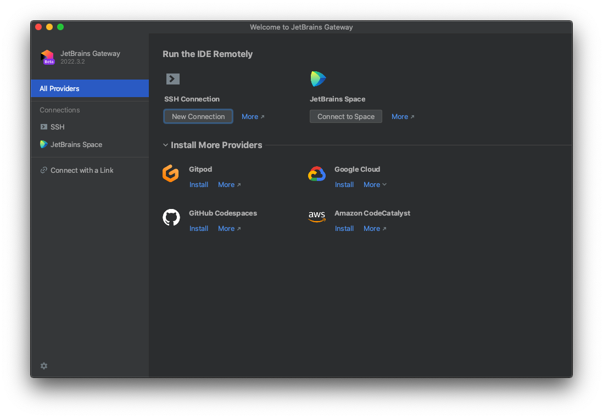
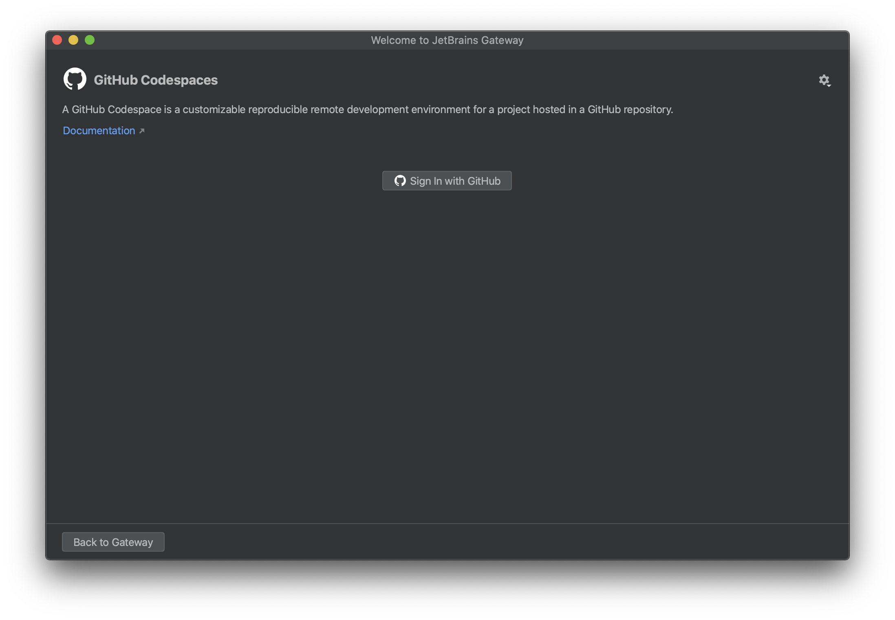
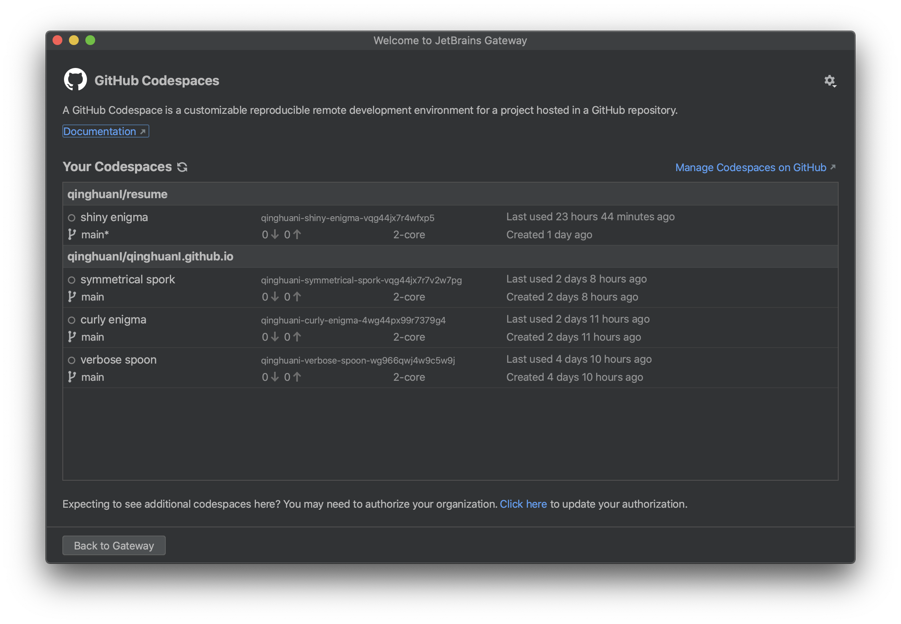
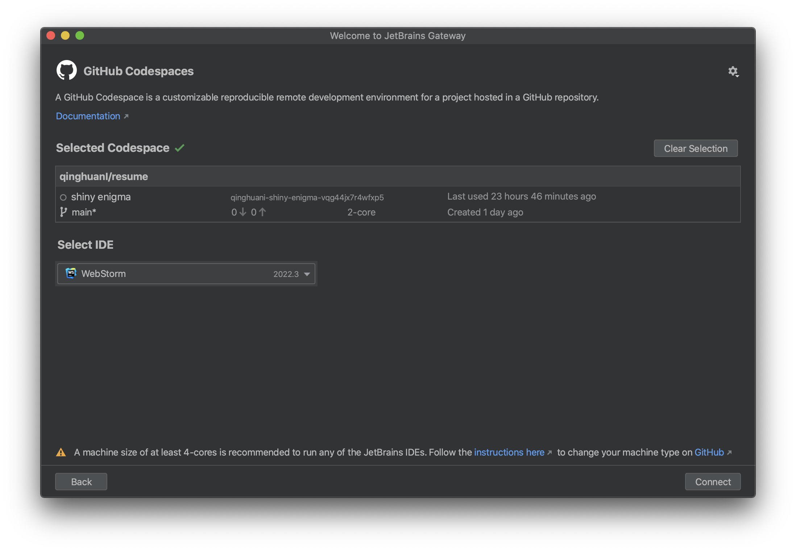
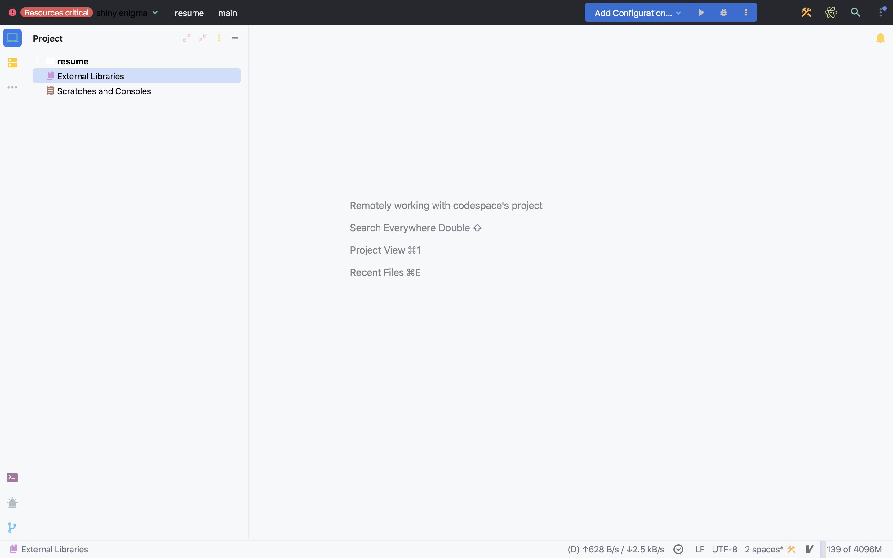

# 远程开发

## 为什么进行远程开发？

无论身处何处数秒内连接至远程环境

- 充分利用远程计算机的强大功能，在任何笔记本电脑上都可以轻松工作，无论其性能如何。借助远程计算机的计算资源，充分利用最大规模的数据集和代码库
- 在远程服务器上保护敏感代码，如果将源代码存储在开发者的笔记本电脑上，那么这些设备被盗或存放不当都将是潜在的安全隐患。通过将代码专门存储在密闭、远程、由公司控制的计算机上可以消除这种风险。
- 保持环境一致性，使用预先确定的工具包、运行时要求、硬件规格等确切内容重现开发环境，这样您就不会再听到“在我的计算机上没有问题呀”这样的对话了！
- 简化入门和技术面试，想要充分测试候选人的技能水平或让新人尽快入门？忘掉 30 项“项目启动”清单吧 – 现在，入门就像采用编排解决方案复制远程计算机一样简单。

## Jetbrains Gateway

2021 年底，JetBrains 推出了 Jetbrains Gateway 工具，这是一款远程开发 Client 并且支持了 JetBrains 全家桶，通过 Jetbrains Gateway 你可以在一台性能羸弱的电脑上，流程运行 JetBrains 家的所有开发工具，JetBrains 官方是这样对它进行描述的：所有远程开发环境的单一入口点。虽然目前还在 Beat 版本，但这也是 JetBrains 布局云端开发的重要一环

### 在本机上安装 Gateway

在浏览器地址栏输入 [https://www.jetbrains.com/zh-cn/remote-development/gateway/](https://www.jetbrains.com/zh-cn/remote-development/gateway/) 链接，进入 Gateway 产品页面，找到下载按钮，点击下载程序安装包，根据提示在本机上正确安装 Gateway 程序

### 配置 Provider

打开 Gateway，产品页面如图所示

Gateway 除了支持内置的 SSH Connection 和 JetBrains Space 外，还支持 Gitpod、 Google Cloud、GitHub Codespaces 和 Amazon CodeCatalyst 等第三方 Provider。笔者在这里选择 GitHub Codespaces Provider 演示，点击 install 按钮，下载 GitHub Codespaces 插件

### 连接 GitHub Codespaces

点击 Connect to Codespaces 按钮，进入 GitHub Codespaces 登录页面，如图所示

点击 Sign In with GitHub，成功登录后，可以看到使用 GitHub Codespaces 打开过的仓库

选择指定代码仓库，点击打开

选择 IDE，点击右下角的 Connect 按钮，Gateway 开始启动运行环境，然后加载项目所有文件，如图所示

开发人员可以直接编辑代码
