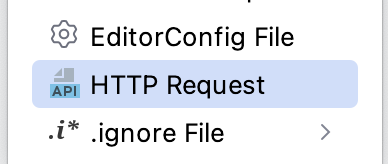
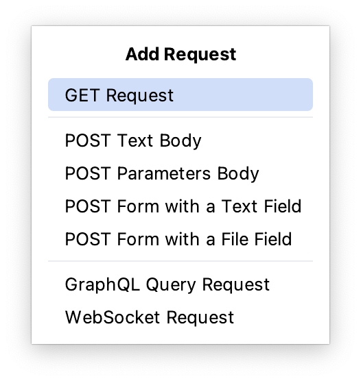
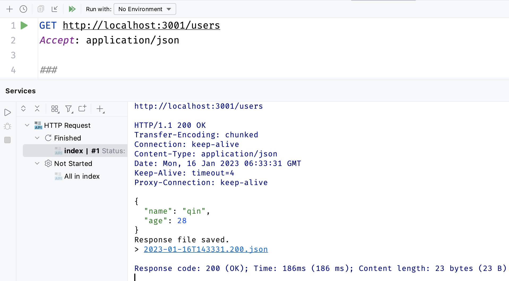
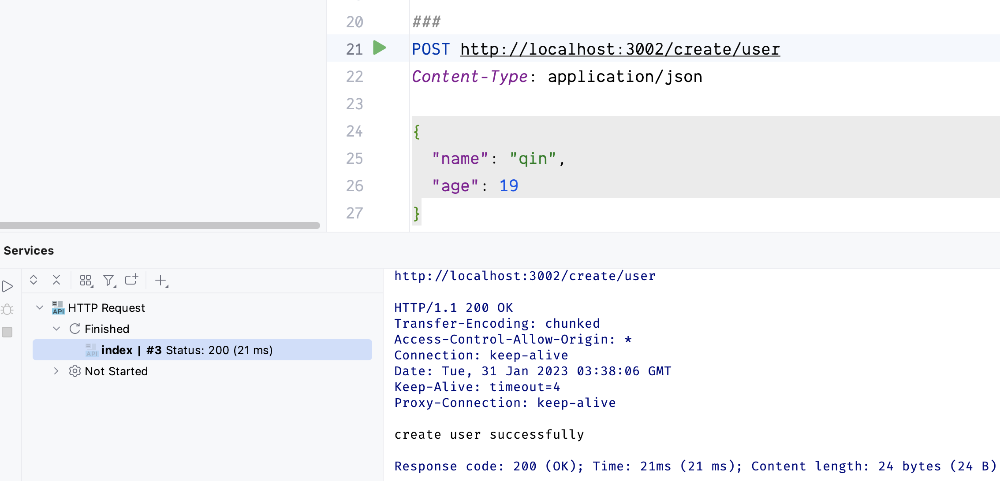
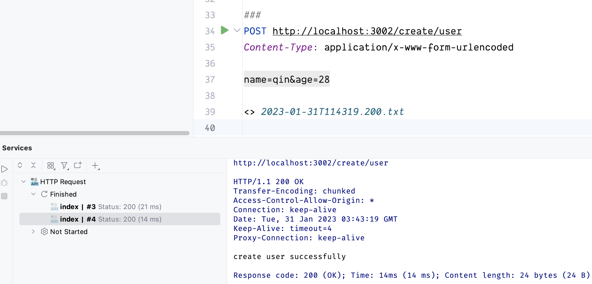

`Rest Client` 是一个用于测试 Restful api 服务的工具。开发人员只需要按照规范编写请求，
就可以向服务器发送 http 请求，并显示服务器响应

Webstorm 默认支持 `Rest Client` 配置，开箱即用

首先创建一个简单的 `web server`，它支持 `GET` 和 `POST` 请求

```js
// server.mjs
import http from "node:http"

const PORT = 3002
const HOST = "localhost"

const request_method = {
  get: "GET",
  post: "POST",
}

const users = [{ name: "qin", age: 18 }]

const server = http.createServer((req, res) => {
  res.writeHead(200, {
    "Access-Control-Allow-Origin": "*",
  })

  if (req.url === "/users" && req.method === request_method.get) {
    res.write(JSON.stringify(users))
    res.end()
  } else if (req.url === "/create/user" && req.method === request_method.post) {
    switch (req.headers["Content-Type"]) {
      case "application/json":
        handlePayload(req, res)
        break
      case "application/x-www-form-urlencoded":
        handleQueryParams(req, res)
        break

      case "form-data":
        handleFormData(req, res)
        break
    }
  }
})

server.listen(3002, () => {
  console.log(`server is running at ${HOST}:${PORT}`)
})

function handlePayload(req, res) {
  let payload = ""
  req.on("data", (data) => {
    payload += data
  })

  req.on("end", () => {
    const { name, age } = JSON.parse(payload)
    if (name && age) {
      res.end("create user successfully")
    } else {
      res.end("failed to create user")
    }
  })
}

function handleQueryParams(req, res) {}

function handleTextByFormData() {}

function handleFileByFormData() {}

function handleFormData(req, res) {}
```

如上图所示，使用 `node.js` 提供的 `http` 模块，创建一个简单的 Web server, 它支持查询所有的 `users` 和创建新 `user`。
下面使用 `Rest Client` 调试来调试这两个接口

将光标聚焦项目工具窗口，点击 Scratches and Consoles 选项，使用 `command + n` 快捷键，调出 `New` 菜单，如图所示



添加以 `.http` 扩展名的文件，以 `index.http` 为例

## GET

点击 <icons-Plus/> 图标，显示 `Add Request` 弹框，



选择创建 `GET Request` 请求，如图所示

点击 <icons-CaretRight/> 图标，`HttpClient` 发起 GET 请求，请求结果如下图所示



## POST

POST 请求有四种传参方式，分别是 `application/json`、`application/x-www-form-urlencoded`、`multipart/form-data` 和 `text/xml`，下面详细讲述如何在 `Rest Client` 中使用四种传参方式

### application/json

application/json 就是常说的 json 传参的数据格式。点击 `POST Text Body` 选项，`Rest Client` 会自动创建对应的示例，
开发人员根据实际接口修改对应字段

```http request
# index.http

POST http://localhost:3002/users
Content-Type: application/json

{
  "name":"qin"
  "age": 28
}

```

点击 <icons-CaretRight/> 图标，`Rest Client` 发起 POST 请求，请求结果如下图所示



### application/x-www-form-urlencoded

`application/x-www-form-urlencoded` 就是常说的表单传值或 `query` 传参

```http request
# index.http

POST http://localhost:3002/create/user
Content-Type: application/x-www-form-urlencoded

name=qin&age=28
```

点击 <icons-CaretRight/> 图标，`Rest Client` 发起 POST 请求，请求结果如下图所示



使用方式如下 `https://api.com/users?name=qinghuanI`

### multipart/form-data

当我们使用 `form-data` 格式传递文本字段时，使用方式如下

```http request
# index.http

POST http://localhost:80/api/item
Content-Type: multipart/form-data; boundary=WebAppBoundary

--WebAppBoundary
Content-Disposition: form-data; name="field-name"

field-value
--WebAppBoundary--

```

当我们上传文件的时候，可以使用 FormData 上传文件内容。使用方式如下

```http request
#index.http

POST http://localhost:80/api/item
Content-Type: multipart/form-data; boundary=WebAppBoundary

--WebAppBoundary
Content-Disposition: form-data; name="field-name"; filename="file.txt"

< ./relative/path/to/local_file.txt
--WebAppBoundary--
```

### text/xml

平常用的很少，暂时不做过多讨论

## PATCH/DELETE/PUT

像 `PATCH/DELETE/PUT` 等请求方法用法跟 `GET` 和 `POST` 差不多，就不再这里讲述
