在工作中，快速熟悉业务代码非常重要，WebStorm 提供 `Structure` 功能帮助开发人员快速掌握业务代码

## 文件结构

> **笔者根据自己的工作经验，认为快速熟悉文件内业务功能，首先要熟悉文件所有定义的方法等。方法是业务功能的载体，熟悉方法可以快速熟悉大致的业务功能。方法是诸多业务逻辑的封装，通过熟悉方法里流程控制语句（`if...else...`、`while`等）
> 熟悉业务细节，由项目到文件，再到方法，终于流程控制语句就能快速熟悉代码**

使用 `command + 7` 快捷键可以调出 `Structure` 窗口，如图所示

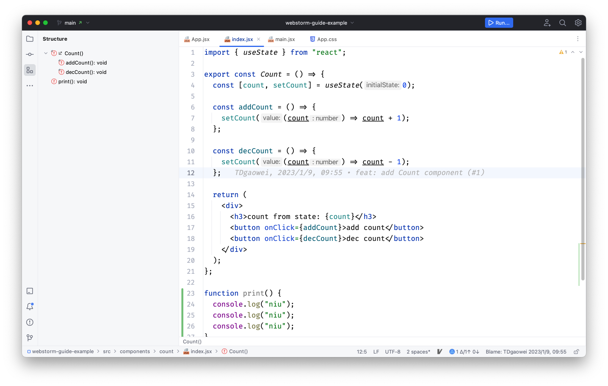

当前的文件有两个重要方法，分别是 `Count` 和 `print`。`Count` 方法中还有 `addCount` 和 `decCount` 两个方法，
文件的组成非常清晰，如果方法的命名非常语义化、贴近业务，对这个文件的作用开发人员就大致了解

`Structure` 窗口会显示当前文件使用的方法（函数）、字段、类和变量等，具体的分类如下

- `function`

```js
function plus() {}
```

- `readonly function`

```js
//eg
const handleClick = () => {}
```

- `variable`

```js
let name = "qinghuanI"

var age = 27
```

- `readonly variable`

```js
const name = "qinghuanI"
```

- `package-local`

```js
class Car {}
```

- `method`

```js
class Car {
  constructor(wheel) {
    this.wheel = wheel
  }
}
```

- `Field`

```js
class Car {
  // wheel 是 field
  constructor(wheel) {
    this.wheel = wheel
  }
}
```

- `method`

```js
class Car {
  constructor(wheel) {
    this.wheel = wheel
  }

  printWheelsCount() {
    return this.wheel
  }
}
```

- `property`

```js
function printStudentInfo() {
  // name and age field is property
  return {
    name: "xiao",
    age: 18,
  }
}
```

## 定义与引用

在文件结构部分，笔者讲到`文件 -> 方法 -> 流程控制语句`熟悉业务代码。但在实际的项目中，变量或方法会在**多个文件**中使用。
WebStorm 支持转到定义和转到引用两个重要功能，帮助开发人员理清变量和方法上下文关系。下面重点讲述这两个方法

### 转到定义

转到定义是根据变量的使用位置或方法的调用位置跳转到变量或方法的定义位置。帮助开发人员快速了解变量的具体值和方法体的业务逻辑

选中变量或方法名，同时使用 `command + 鼠标左键` 或 `command + b` 快捷键，光标从变量或方法名使用位置跳转到变量或方法定义的位置

### 转到引用

转到引用是根据变量或方法定义位置查看变量的使用位置或方法的调用位置。帮助开发人员快速了解变量或方法的使用上下文

选中变量或方法名，同时使用 `command + 鼠标左键` 或 `command + b` 快捷键，会显示弹框，呈现变量或方法的使用列表

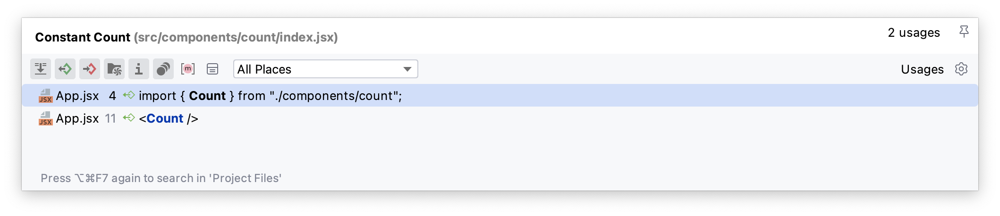

查看每个文件的变量或方法使用情况，进而熟悉业务

有时候由于项目配置等问题，转到引用的功能会失去作用。可以尝试下面的办法

在文件内搜索/全局搜索该变量或方法出现的位置，再进一步分析，熟悉业务

该方法不如`转到引用`直接、简单。但是可以在一定程度上帮助开发人员快速熟悉业务

## 书签

熟悉大型项目中，搜索文件和文件夹会很耗时。对于这种情况，WebStorm 提供书签功能。开发人员可以为必要的代码行添加书签，以便更轻松地找到它们

WebStorm 有两种类型的书签：

- 匿名书签没有标识符，允许您放置任意数量的书签。标有匿名书签的文件和行有一个书签图标
- 助记书签允许您用数字（0 到 9）或字母（A 到 Z）创建书签。用助记书签标记的文件和行在框架中有相应的字母或数字图标。

### 匿名书签

在装订线区域点击鼠标右键，显示添加书签的弹窗，如图所示

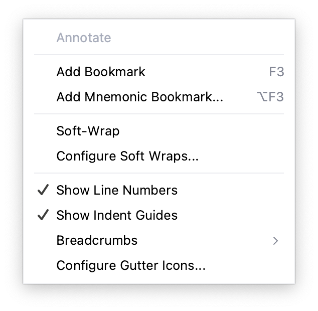

点击 Add Bookmark 选项，即可添加匿名书签。如图所示，会在行号右边添加书签的图标


点击 `command + 2` 快捷键，调出 `Bookmarks` 面板，可以查看所有的书签

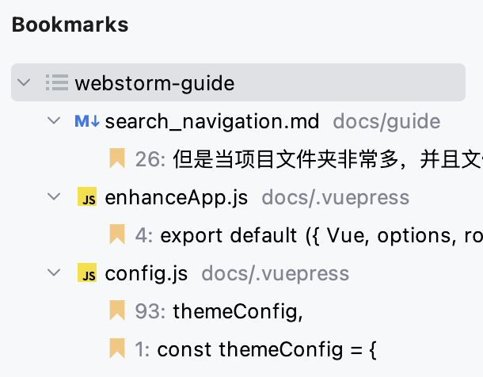

点击标签，可以跳到标签具体的位置

### 助记书签

点击 `Add Mnemonic Bookmark...` 选项，即可添加助记书签。如图所示，会显示 `Add Mnemonic Bookmark` 弹窗

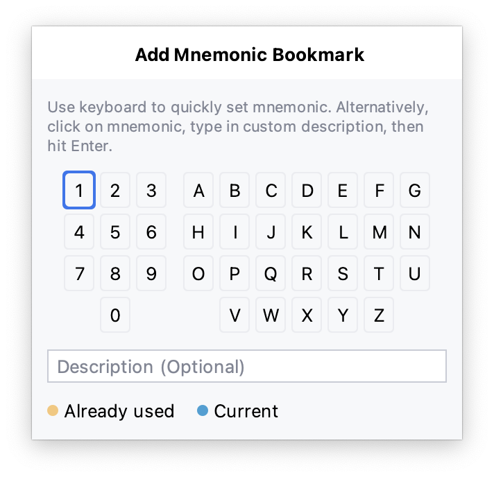

点击数字或字母，输入描述内容（可选），即可创建助记书签。如图所示，助记书签会在行号右边添加对应的数字或字母


查看助记书签和跳转同匿名书签功能一样

当我们熟悉一段业务逻辑时，涉及当变量或函数出现在多个文件中，此时可以使用书签功能，根据函数执行前后顺序
加上书签，方便开发人员快速理清代码逻辑

## 快捷键

在`定义与引用`中说到`转到定义`和`转到引用`跳转，与此相关几个非常重要的快捷键

- `command + option + <` - 返回光标上一次的位置
  > 比如使用 `转到定义`时，光标从方法的调用位置跳转到方法的定义位置，使用 `command + option + <` 快捷键可以直接回到方法的调用位置
- `command + option + >` - 返回光标下一次的位置
- `command + b` - 转到定义/转到引用
  > 比如选中方法调用，跳到方法定义的地方

## UML

UML 是统一建模语言的简称，它是一种由一整套图表组成的标准化建模语言。UML 用于帮助系统开发人员阐明，展示，构建和记录软件系统的产出。UML 主要使用图形符号来表示软件项目的设计，使用 UML 可以帮助项目团队沟通、探索潜在的设计和验证软件的架构设计

## Gutter Icons

Gutter Icons 位于编辑器的左侧。它们调用一些基本操作和其他特定于框架和技术的特性。如图所示

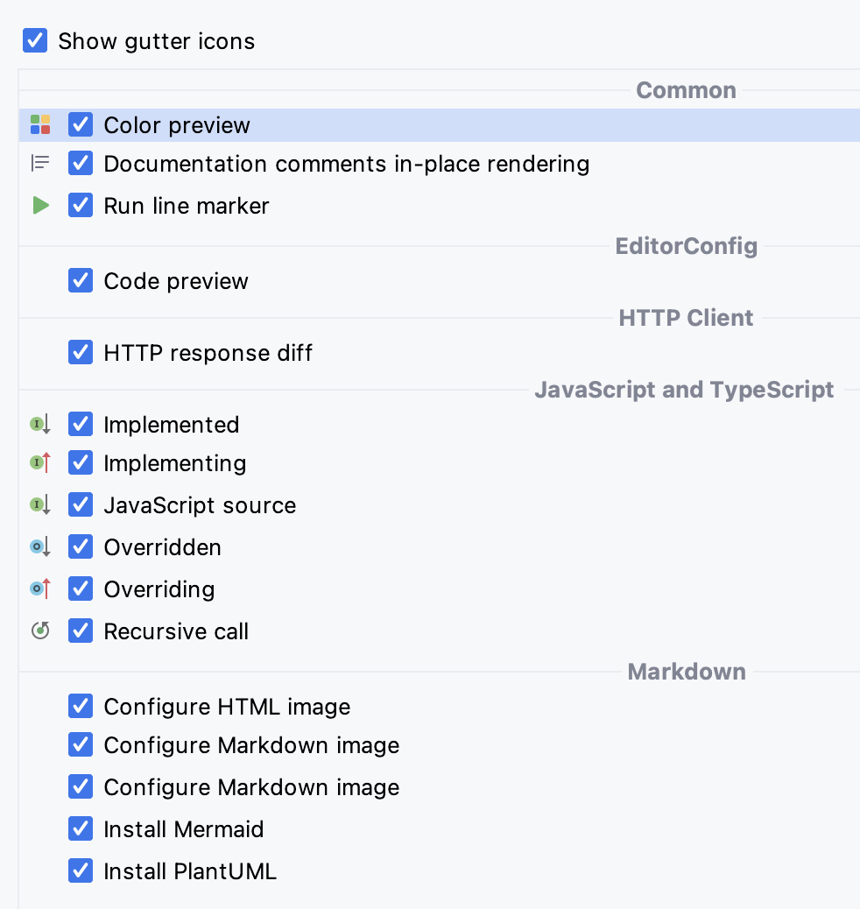

重点看 `JavaScript and TypeScript` 配置部分。从上往下依次表示

- 已实现
- 实现中
- JavaScript 源码
- 已重载
- 重载中
- 递归调用

<el-tabs type="border-card">
  <el-tab-pane label="Implemented">
    表示方法已经实现了
  </el-tab-pane>
  <el-tab-pane label="Implementing">
    表示该方法是实现接口中定义的方法
  </el-tab-pane>
  <el-tab-pane label="JavaScript source">JavaScript source</el-tab-pane>
  <el-tab-pane label="Overridden">
    表示该方法或该变量被覆盖
  </el-tab-pane>
  <el-tab-pane label="Overriding">
    表示该方法或该变量是覆盖方法或变量
  </el-tab-pane>
  <el-tab-pane label="Recursive call">
    当开发人员编写递归方法调用时，WebStorm 会显示递归调用的图标
  </el-tab-pane>
</el-tabs>

## 文件的历史修改记录

`git blame` 用来追溯一个指定文件的历史修改记录。它能显示任何文件中每行最后一次修改的提交记录。
但是纯命令的显示结果很难让开发人员阅读修改记录。WebStorm 提供了便捷的 diff 可视化工具，清晰、直观
地显示文件每一次的历史修改记录

在内容编辑区，点击鼠标右键，可以查看功能列表，选择 Git 选项，如图所示

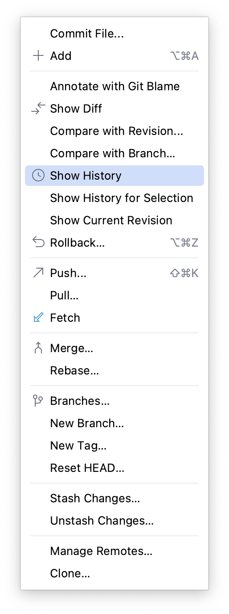

点击 `Show History` 选项，弹出文件历史修改记录表

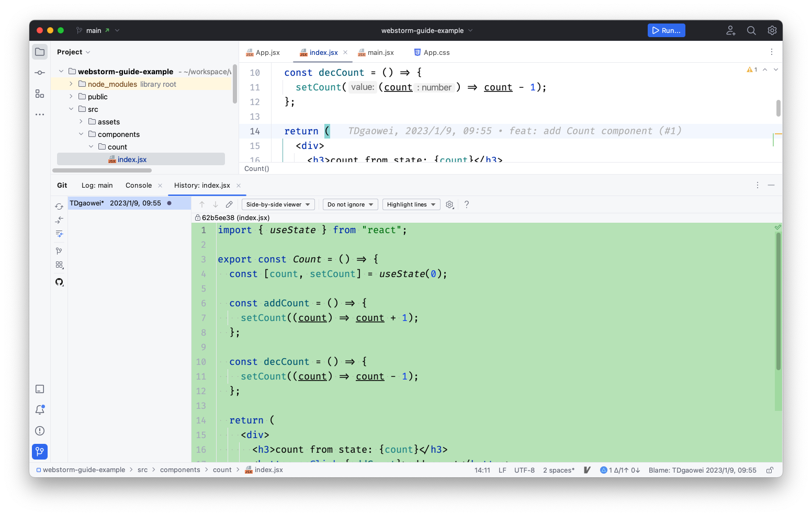

切换提交记录，右边区域显示每次提交记录的代码片段变更，方便开发人员理解需求变化

左侧有一列功能菜单，点击 GitHub 图标，可以跳转对应的 PR，查看该 PR 改动了哪些文件

## GitHub Gist

GitHub Gist 可以向别人分享代码片段

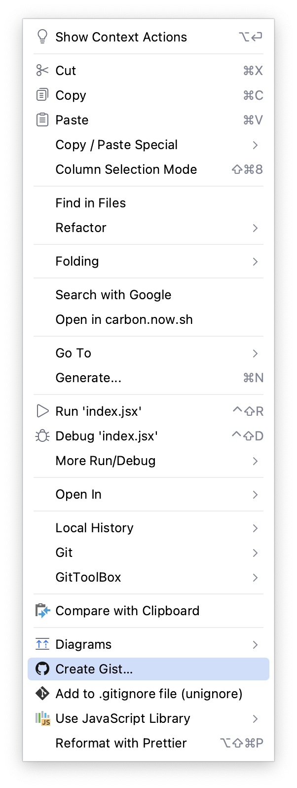

选择 `GitHub Gist...` 选项，可以看到 `GitHub Gist` 弹框

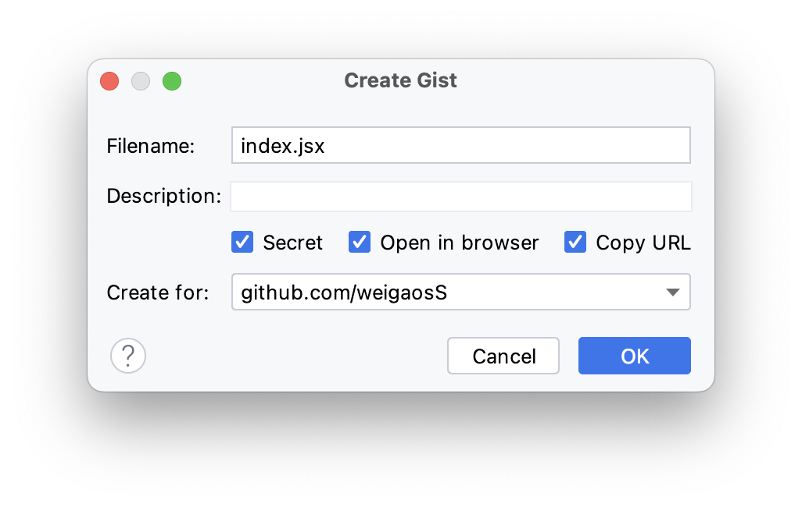

点击 `OK` 按钮，就可以看到分享的代码片段

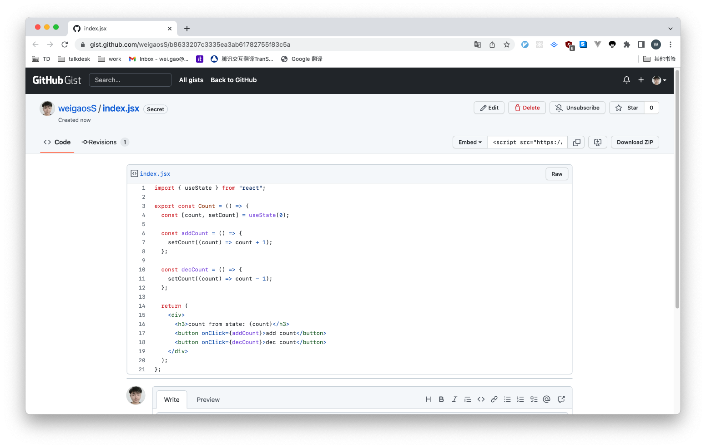

就可以把链接分享出去，他人就可以查看你分享的代码片段
