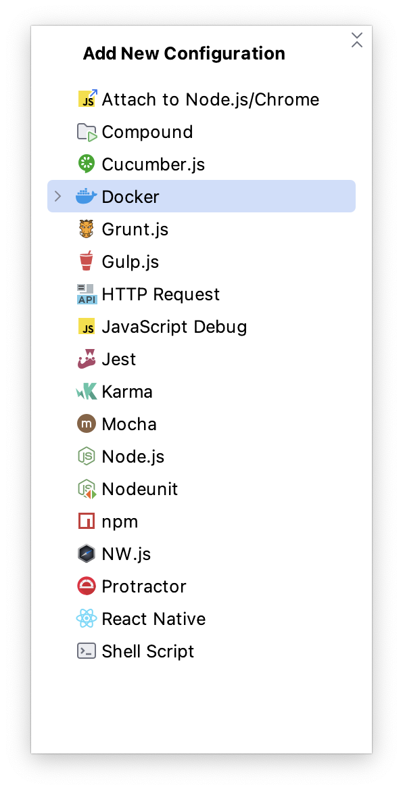
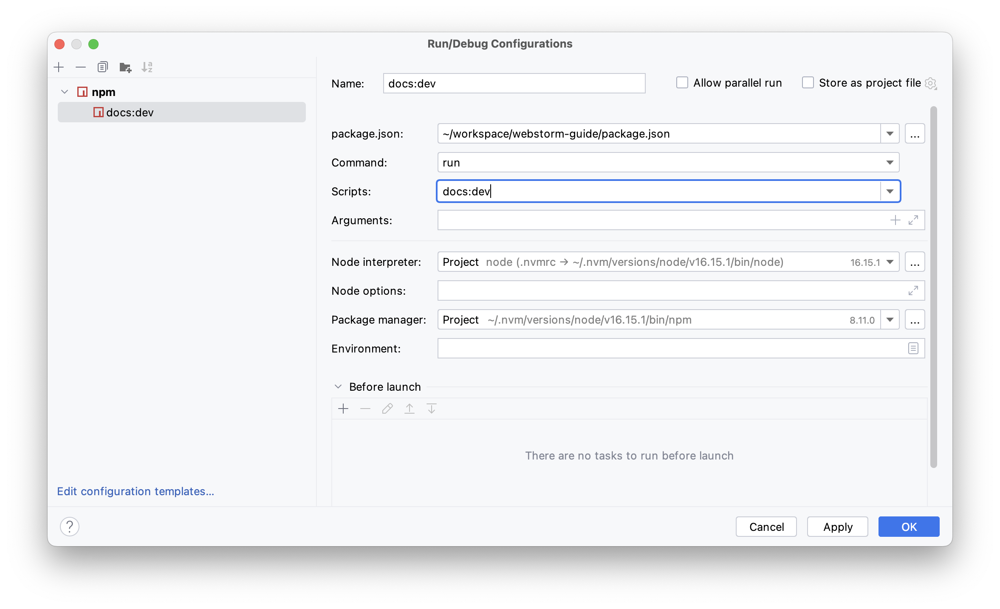
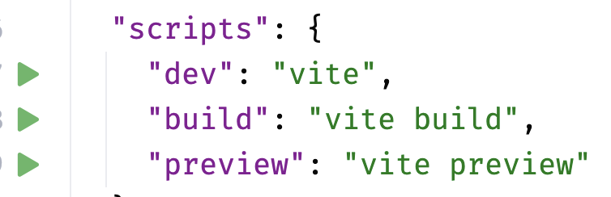
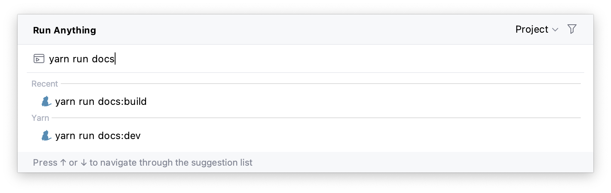
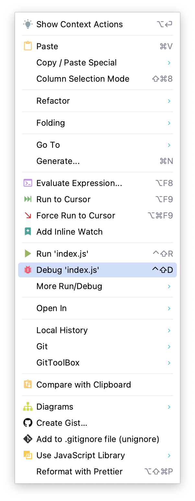
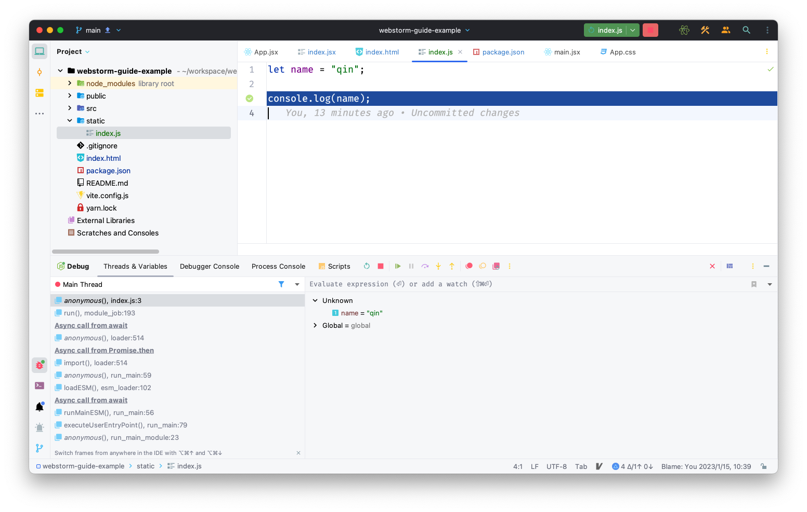

运行/调试配置

WebStorm 提供很多可选的配置选项，如下图所示

在前端日常的工作中，主要用到 `JavaScript Debug`、`Node.js`、`npm` 和 `jest` 等

## npm

在前端的 SPA 项目中，我们都会用到 `npm scripts` 功能。比如用 `create-react-app` 生成的 `react` 项目，我们会在终端里运行 `yarn start` 启动项目

在 WebStorm 里，提供多种 `npm scripts` 使用方式

在 `Add New Configuration` 菜单中，选择 `npm` 选项，会显示 npm 配置弹框，选择 `Script`，然后点击按钮保存

点击选中的 `Script`， WebStorm 就会在后台运行 `npm scripts`

或者打开项目的 `package.json` 文件，找到 `scripts` 字段

点击 <icons-CaretRight/> 运行该 `script`，WebStorm 会自动打开 `Terminal` ，然后在 `Terminal` 里运行 `yarn run dev`。
WebStorm 会自动完成 `npm scripts` 配置

或者双击 `control`，调出 `Run Anything` 弹窗，直接输入 `npm scripts` 命令，支持模糊匹配，选择命令然后点击执行

## jest

当我们使用 Jest 编写单元测试的时候、会遇到编写的测试无法通过的情况，那么我们可以对编写的测试进行**断点调试**

首先我们在指定的代码行号设置断点

然后在终端里输入 `node --inspect-brk ./node_modules/jest/bin/jest.js --runInBand filePath` 命令、并执行

## Node.js

开发人员可以在 WebStorm 里直接调试运行在 Node.js 运行环境中的 `javascript` 代码

在选中的文件内，点击鼠标右键，弹出功能菜单，

点击 `Debug index.js` 选项，进入 `Debug` 模式，如图所示

通过 `Debug` 面板提供的功能，进行具体的问题分析
