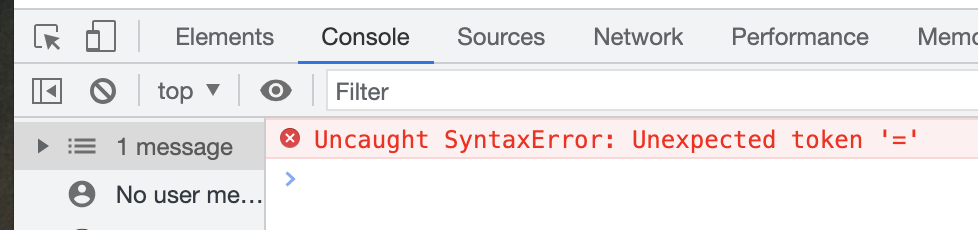

在 WebStorm 中，JavaScript 调试器开箱即用。使用 WebStorm，您可以调试用 `JavaScript`或`TypeScript` 编写的各种应用程序：`Node.js`、`React Native` 和 `Electron` 应用程序，当然还有使用不同框架编写的客户端应用程序，例如 `react.js` 和 `Vue.js`。除此之外，您还可以调试单元测试和构建脚本

在编译性语言中，CPU 的指令集中有 `INT3` 指令。

对于 Javascript 解释性语言通过解释器解析执行、解释器模拟编译语言的执行环境、在软件层面提供 `INT3` 指令。
当我们设置断点的时候， 当 CPU 执行到 `INT3` 指令时，CPU 会进入中断模式，调试工具把断点处的指令第一个字节保存起来，
然后写入 `INT3` 指令，然后通过调试工具提供的功能、针对性的分析代码

根据代码运行环境的不同，主要分为服务端调试和客户端调试

## 服务端调试

## 客户端调试

笔者目前推荐使用 `Chrome Devtool` 调试运行在 Chrome 浏览器里的前端代码

在任意浏览器标签页，使用 `command + option + j` 快捷键打开开发者工具

### 调试 html 代码

查看 Element 面板，左边显示 DOM 树，使用鼠标选中 DOM 元素，点击鼠标右键，显示对应的操作

### 调试 css

打开 Element 面板时，选中 DOM 元素，右侧区域显示对应的 css 样式

### 调试 JS

JavaScript 是前端里最重要的编程语言，作为一门灵活的脚本语言，理清 JS 解析和运行原理，才能更好的调试 JS

当客户端加载完来自网络中 JS 脚本后，JS 解释器便开始解析 JS 代码，先对进行词法分析、语法分析，如果存在语法错误，解释器会直接跳出这段 JS 脚本，加载解析下一段 JS 脚本，
如果没有语法错误，解释器将进入预解析阶段，该阶段会构建活动变量，作用域和确定 this 指向，最后执行 JS 代码

在 JS 解释器解释并执行代码的过程中，会有下列三类错误发生

- 语法错误

JS 语法错误发生在语法分析阶段，解释器发现语法错误后，会直接跳出这段脚本，并在 Chrome Devtool 的 Console 面板里输出错误详情，发生语法错误代码之后的代码不会执行，接着解释器会加载执行下一段脚本，
如果没有下一段脚本，那么 JS 解释结束

```html
<!DOCTYPE html>
<html lang="en">
  <head>
    <title>debugger</title>
  </head>
  <body></body>
</html>

<script type="text/javascript">
  const = 1                    // <--- 语法错误，跳过该段脚本，直接执行第二段脚本
  console.log('first script') // <--- 不会执行
</script>
<script type="text/javascript">
  console.log("second script") // 会正常执行
</script>
```

示例代码中，`const = 1` 发生语法错误，解释器跳过该段脚本，那么 `console.log('first script')` 不会执行。第二段脚本中的 `console.log("second script")` 正常执行

项目中的 JS 代码发生语法错误，理论上页面会直接无法正常显示或局部页面无法正常显示，另外在 Chrome Devtool 的 Console 面板里会直接显示错误。比如 `const = 1` 造成的语法错误



对开发人员来说，语法错误直观明显，需要立即处理

- 运行时错误

运行时错误发生在代码执行过程中，解释器发现运行时错误后，会直接跳出这段脚本，并在 Chrome Devtool 的 Console 面板里输出错误详情，发生运行时错误代码之后的代码不会执行，接着解释器会加载执行下一段脚本，
如果没有下一段脚本，那么 JS 解释结束

```html
<!DOCTYPE html>
<html lang="en">
  <head>
    <title>debugger</title>
  </head>
  <body></body>
</html>

<script type="text/javascript">
  console.log(a) // <--- 运行时错误，跳过该段脚本，直接执行第二段脚本
  console.log("first script") // <--- 不会执行
</script>
<script type="text/javascript">
  console.log("second script") // 会正常执行
</script>
```

通过分析，对开发人员来说，运行时错误也直观明显，需要立即处理

- 资源加载错误

客户端加载所有来自网络中的资源时，如果某些资源无法加载，客户端会直接抛出资源加载错误，资源加载错误不一定会造成页面无法正常显示。
开发人员可以通过在 Chrome Devtool 的 Console 面板里查看资源加载错误

#### 如何调试

- 通过 Chrome Devtool 的 Console 查看报错信息

不论是语法错误、运行时错误，还是资源加载错误，Chrome 调试工具的 Console 都可以看到错误详情，会告诉开发人员错误类型，错误发生的调用栈情况

- 普通断点/条件断点

在 Chrome Devtool 的 Source 面板中，在对应的行号槽添加断点，当 JS 解释器执行到该处时会进行调试环境，可以查看代码的内容

- 事件监听
