# Git 操作

## 克隆仓库

点击 `VCS` 按钮，可以看到 `Get from Version Control` 弹框，如图所示

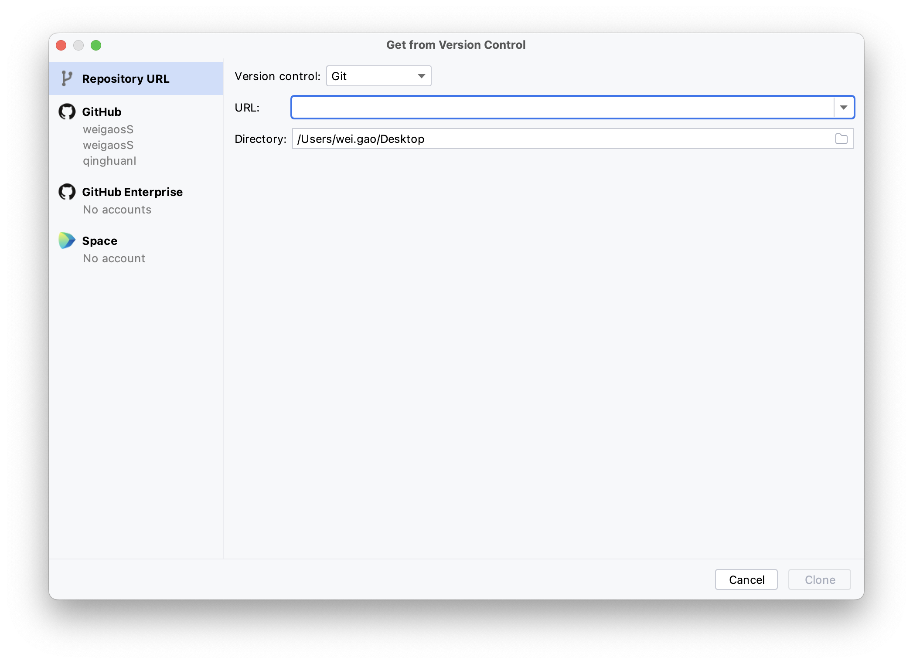

- 在 URL 输入框输入需要克隆的仓库链接
- 在 Directory 选择克隆的仓库位置

## 查看分支

在 WebStorm 的 `New UI`里，工具的**左上角**直接显示当前分支名称

如图所示，当前分支是 `main` 分支

## 更新分支

当当前分支当远程分支有最新代码时，WebStorm 会提示有最新代码需要更新，如图所示

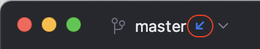

在分支名的右边，有一个<icons-BottomLeft/>的图标，提示开发人员更新最新的代码

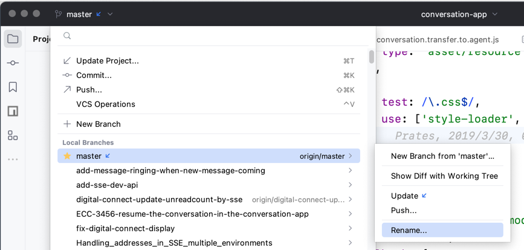

点击分支下拉框、选择本地的当前分支、点击当前分支，会弹出一个提示框、选择 `Update` 即可同步远程分支最新代码

## 新建分支

点击分支下拉框、会看到 git 相关操作弹框，如图所示

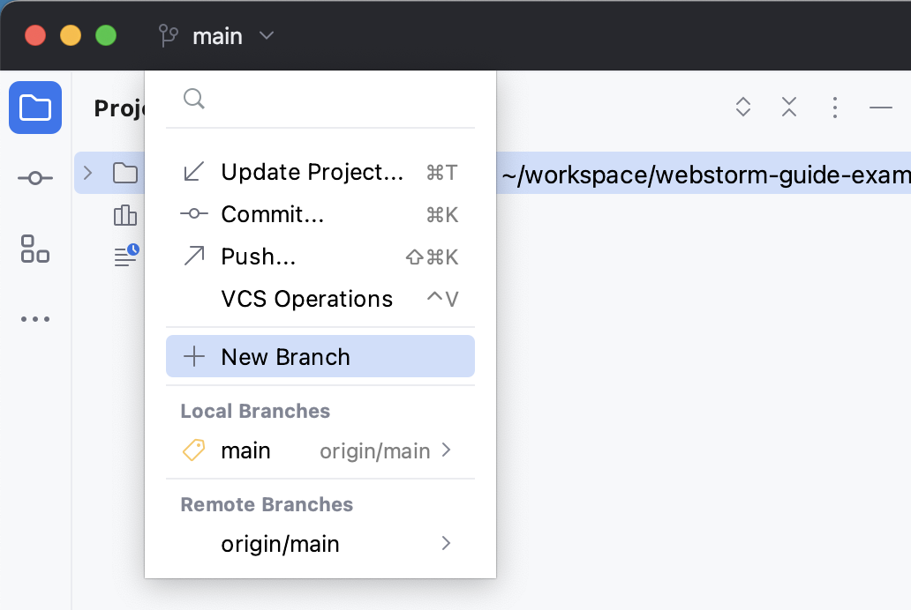

点击 `+ New Branch`选项，会看到 `Create New Branch` 弹框，输入分支名即可创建新分支

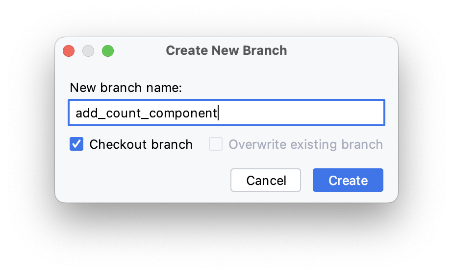

## 提交修改

当开发人员开发完功能时，可以使用 `command + 0` 快捷键查看文件改动

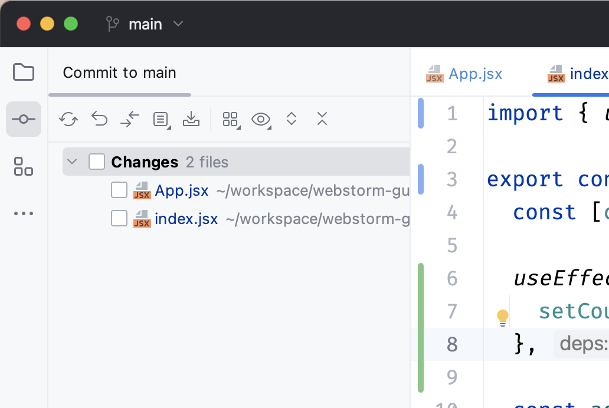

使用 `command + k`，聚焦到 commit 编辑区

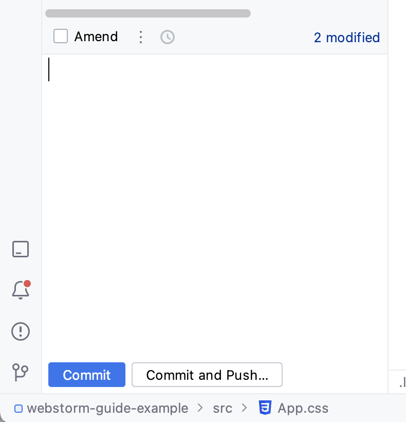

开发人员直接在编辑区里输入准确的 commit 信息

- 点击 `Commit` 按钮，即可将文件改动加入本地分支
- 点击 `Commit and Push...` 按钮，文件改动加入本地分支并推送至远程分支

如果开发人员在一个分支上执行多次 commit 操作，会留下多个 commit 记录，如果项目有要求保持干净 commit 记录
可以再第二次的 commit 操作时，勾选上 `Amend` 选项，相当于使用 `git commit --amend` 命令，最后再强制提交，
那么该分支将只会有一个 commit 记录

## 压缩修改记录

开发人员在一个 PR 上提交了多次修改，那么 `commit` 的信息会有很多条。如果存在无意义的 `commit`,
可以对无意义的 `commit` 进行合并，使 `commit` 清晰明了。压缩修改记录需要使用 `git rebase -i HEAD~n`

## 提交分支

当完成改动加入本地分支操作后，如果选择点击 `Commit and Push...` 按钮，文件改动加入本地分支并推送至远程分支

如果点击 `Commit` 按钮，即可将文件改动加入本地分支，此时可以使用 `command + shift +k` 快捷键

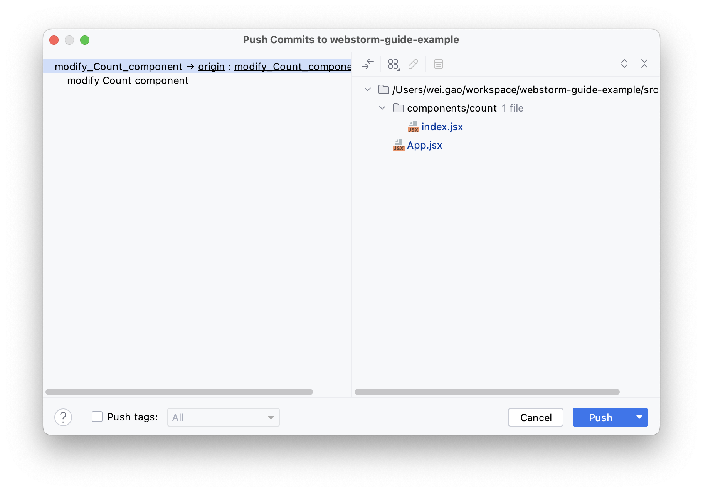

点击 `Push` 按钮，即可将本地分支的改动同步到远程分支上

## 删除分支

点击分支下拉框，可以看到所有的本地分支和远程分支列表

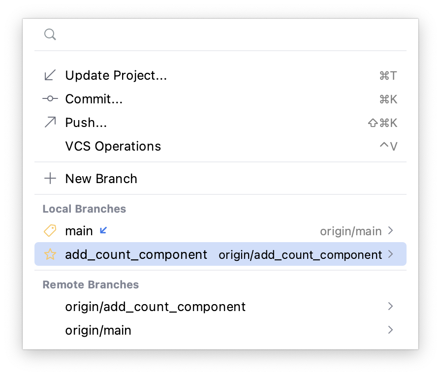

选择要删除的本地分支/远程分支，如图所示以删除本地分支为例

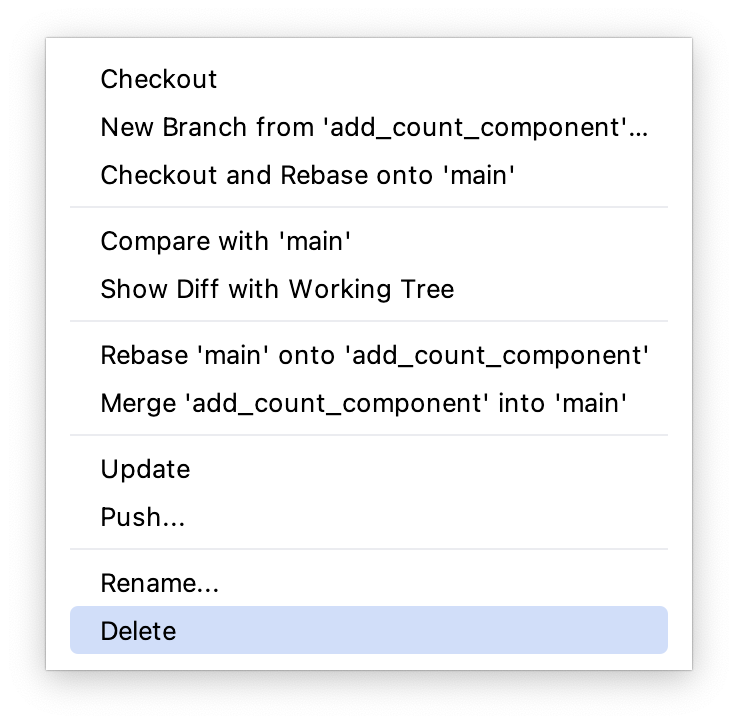

点击 `delete` 选项，即可删除本地分支

## 贮藏改动

将鼠标移至内容编码区、点击鼠标右键

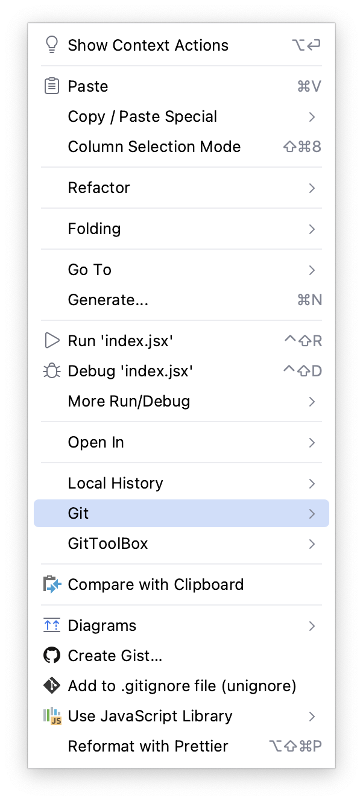

点击 `Git` 选项、可以看到详细的操作列表

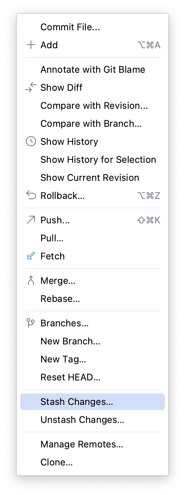

点击 `Stash Changes...` 选项，可以看到 `Stash` 弹框

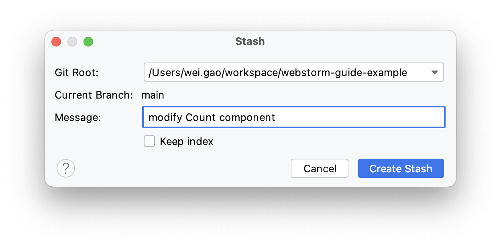

点击 `Create Stash` 按钮、即可创建一个 `Stash`

根据`新建分支`的指导，创建 `modify_Count_component` 分支，对 `Stash` 的内容在新分支上 `Unstash`

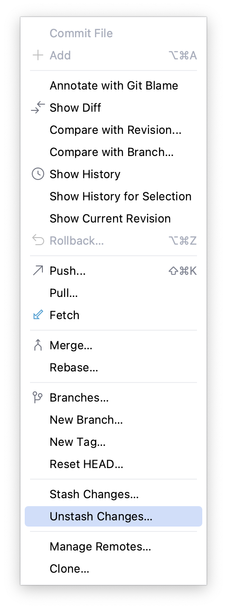

点击 `Unstash Changes...` 选项

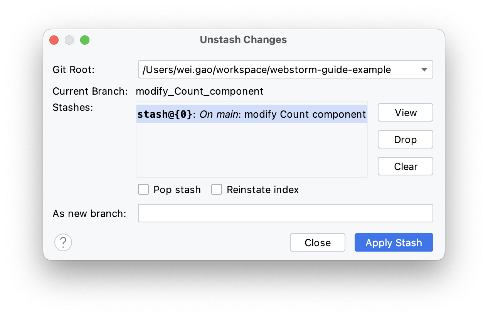

点击 `Apply Stash` 按钮，就将 `Stash` 的内容移动到新分支上

## 回滚修改

### 文件回滚

当开发人员需要放弃整个文件的改动、使用 `command + 0` 快捷键，聚焦文件 `Changes` 区域，选择指需要回滚的文件，

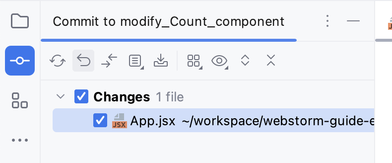

点击回滚的选项，会弹出 `Rollback Changes` 窗口

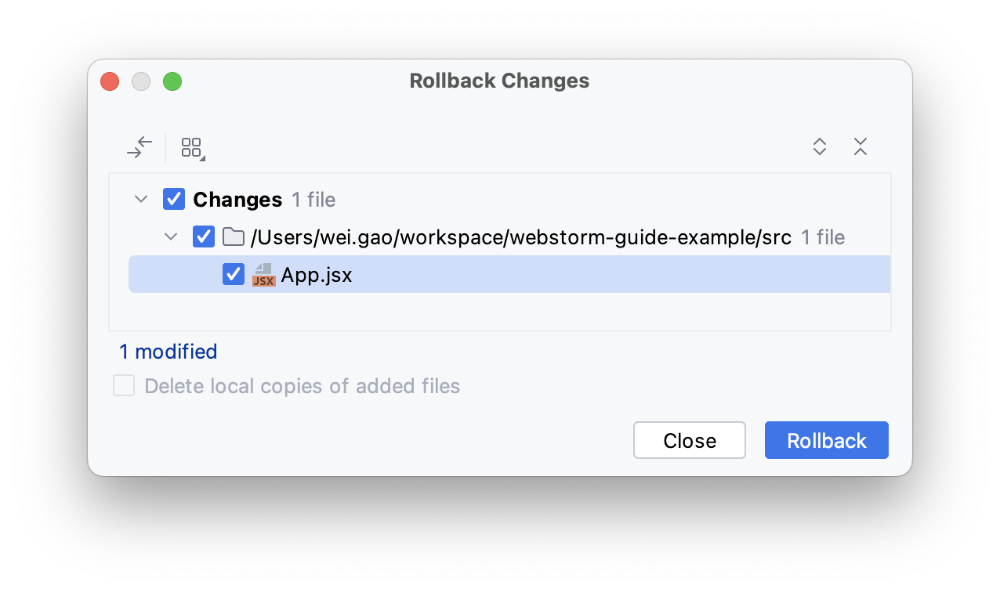

点击 `Rollback` 按钮，即可回滚选中的文件

### 代码块回滚

当开发人员需要放弃局部代码改动时，可以点击代码左侧当状态条，会显示操作弹框

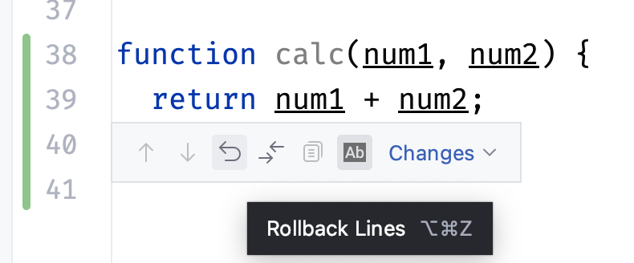

点击 `Rollback Lines` 选项，即可回滚代码块

## 撤销操作

`git revert` 操作是将选择的某一次提交记录重做，若之后又有提交，提交记录还存在，只是将指定提交的代码给清除掉

使用 `command + 9` 调出分支的 commit log， 如图所示

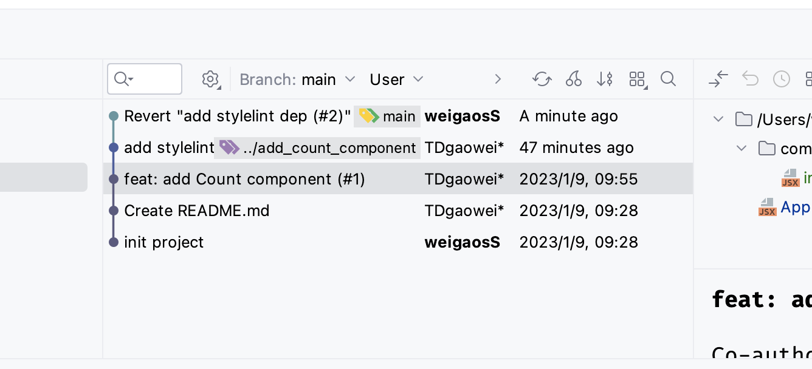

选择要 revert 的 commit，点击鼠标右键，显示操作弹框

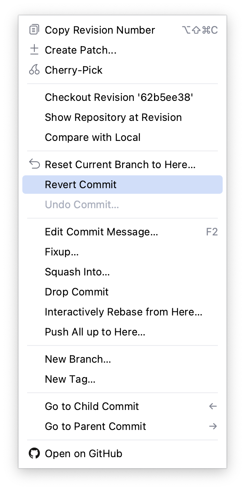

使用 `command + k` 快捷键，直接提交修改到远程分支

## 版本回退

`git reset` 重置 `HEAD` 和指定提交之间的所有更改，根据传入的参数不同，处理结果如下

### mixed

`git reset --mixed` 撤销 HEAD 和指定提交之间的所有更改，但会将更改保留在工作目录中，作为未暂存的更改。Git 默认会使用--mixed。

### soft

`git reset --soft` 将 HEAD 移回指定的提交，撤消 HEAD 指向的位置和指定提交之间所做的所有更改，并将所有更改保存在索引中。换句话说，Git 会重新添加暂存的更改，准备再次提交。

### hard

`git reset --hard` 会自动丢弃 HEAD 和指定提交之间的所有更改。所以要慎用。

### keep

## 创建、删除标签

在内容编辑区里，点击鼠标右键，显示操作上下文

点击 Git 选项，显示 Git 功能菜单

选择 `New Tag...` 选项，即可创建标签

## 分支变基

在内容编辑区里，点击鼠标右键，显示操作上下文操作

点击 Git 选项，显示 Git 功能菜单

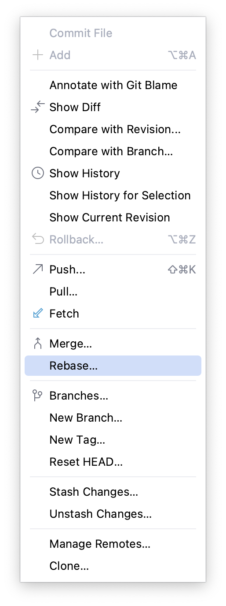

选择 `Rebase...`选项，弹出 Rebase 操作窗口

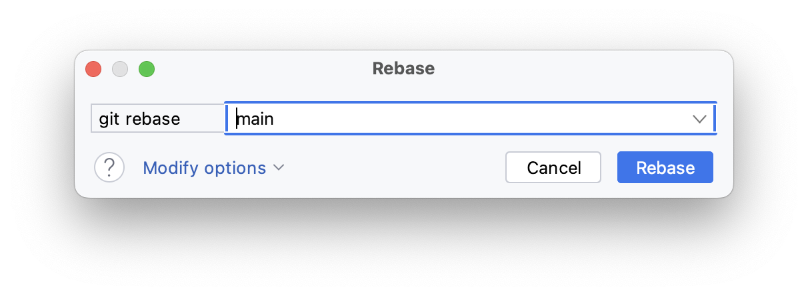

选择需要 `rebase` 的分支，点击确认按钮即可实现分支变基

## 解决冲突

当开发人员使用分支变基的功能时，可能会出现代码合并冲突。WebStorm 提供了非常棒地可视化解决冲突的功能

## 择优挑选

择优挑选即 `git cherry-pick` 操作，选择将现有的一个或者多个提交的修改引入当前内容

## 文件状态颜色

WebStorm 内置文件各种操作后的颜色状态，如下图所示

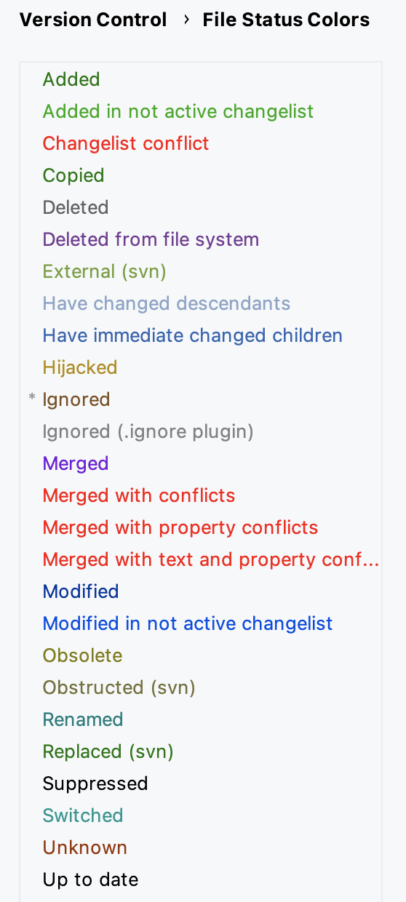

从图中可以看出，文件状态颜色的种类很多，开发人员只需要重点记住以下文件状态

- `added` 表示新增文件
- `modified` 表示文件被修改
- `deleted` 表示该文件被删除
- `renamed` 表示文件重命名

还可以通过勾选 `Changes` 查看文件改动类型，如下图所示

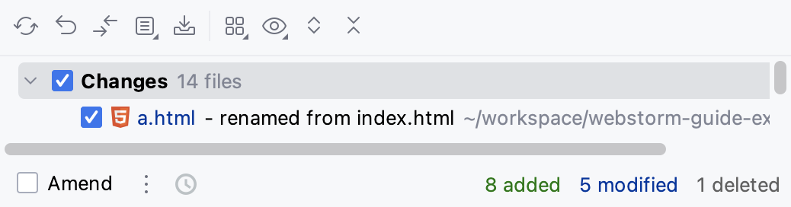

上图的右下角显示文件改动类型
