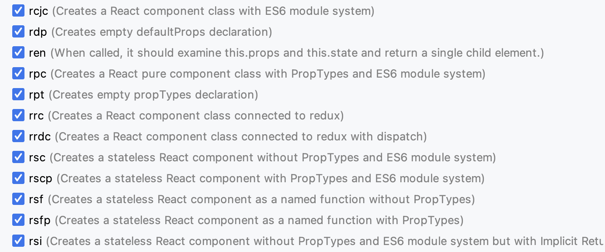

## 代码检查

WebStorm 内置代码检查功能。可以通过 `Preferences -> Editor -> Inspections` 查看代码检查详细配置


图中显示很多语言、框架或库的检查规则选项，根据开发需要，可以对它们重新设置。以 `Javascript` 和 `Typescript` 为例：


WebStorm 提供详细检查分类和规则描述，根据项目要求和开发需要，可以设定不同对检查结果优先级，
选中某个文件时，WebStorm 基于配置的规则对代码实时检查，并进行提示，如下图所示


在内容编辑区对**右上角**，会给出静态检查结果

- <icons-Check/> 表示检查完全通过
- ⚠️ 表示存在问题、点击查看详情
- <icons-Error/> 表示有静态语法错误

针对上述检查结果， 点击检查结果或使用 `command + 6` 调出检查面板，查看问题详情


WebStorm 根据优先级进行分类，并给出问题描述，方便开发人员解决问题

## Inlay Hints

`Inlay Hints` 即内嵌提示，函数调用时提示形参列表。如下图所示


定义的 `printInfo` 方法，形参是 `student`, 调用 `printInfo` 时，会有灰色的 `student` 形参提示

## Live Templates

`Live Templates` 用来配置动态模板，可以在指定位置使用缩写字母自动生成代码片段。`WebStorm` 已经内置诸多动态模版，如下图所示。


下面以内置的 React 模版为例详细讲述此功能。WebStorm 提供了很多 React 模版，下图仅仅展示部分



在编辑器里输入 `rsc`，根据智能提示点击 `rsc` 选项，会自动在光标下面生成如下代码块

```jsx
import React from "react"

const Index = () => {
  return <div></div>
}

export default Index
```

一个 `Function` 类型的 `React` 组件直接生成，整个过程非常快速和高效

WebStorm 内置模版非常多，建议读者有时间可以一一体验

## File Templates

`File Templates` 用来配置文件和代码模板，即文件在创建的时候自动会按文件模板生成代码文件。
而 `Live Templates` 是输入特定的缩写字母、依据 WebStorm 智能提示，在指定的位置动态插入代码片段

WebStorm 同样内置了很多代码模版，如图所示


以 `Vue Single File Component` 为例，开发人员创建 `.vue` 文件时，选择以`Vue Component`，则会
创建包含 `vue2` 语法规范的代码模版新文件

```vue
<template></template>

<script>
export default {
  name: "Example",
}
</script>

<style scoped></style>
```

## 重复代码

WebStorm 会检查项目中所有的文件中重复的代码块并提示。默认的代码片段是 `45units`，支持自定义大小


重复代码功能有利于帮助开发人员优化代码。下面具体讲述重复代码功能的效果


WebStorm 会在重复代码的第一行给出 `warning` 提示，点击 `Show all duplicates like this` 选项，
将显示 Duplicates 面板，如图所示


Duplicates 面板右边区域会显示重复代码的 diff 区别

## 比较项目文件

使用鼠标选择当前文件，并按下 `shift` 键选择要比较的文件，然后使用 `command + d` 快捷键，WebStorm 将打开一个内置的差异查看器，开发人员可以在查看器中清楚地查看文件之间的所有差异，并在它们之间导航


## Context Actions

当光标在代码行，按下 `command + enter` 快捷键，WebStorm 会根据光标所在位置的上下文给出可能的操作。下面举一个简单的例子说明该功能


如上图所示，定义了一个 name 变量，值是单引号的字符串，现在想把单引号变成双引号，按下 `command + enter` 快捷键，
WebStorm 根据上下文给出五条操作，第一条操作就是将单引号字符串变成双引号字符串，点击该操作即可完成转换操作

`Context Actions` 跟上下文紧密相关，不同的上下文会给出不同操作列表。该功能需要开发人员多花时间体验

## Prettier

WebStorm 的 `command + option + l` 快捷键对当前的文件进行简单的格式化，但是这远远不够。

`Prettier` 是一个强制的代码格式化程序，支持: `JavaScript` (including experimental features)、`JSX`、`Angular`、`Vue`、`Flow`、`TypeScript`、`CSS`、`Less`、`SCSS`、`HTML`、`Ember/Handlebars`、`JSON`、`Markdown`、`GFM`、`MDX`、`YAML` 格式

首先在项目根目录安装 `prettier` 包

```shell
yarn add prettier -D
```

然后按照 `Preferences -> Languages&Frameworks -> Javascript -> Prettier` 打开 `Prettier` 配置


第一步选择使用 Prettier package 版本，作者选择的是 `prettier@2.8.2`

然后输入需要格式化的文件类型，只需要在输入对应的文件扩展名即可

最后勾选上 `On 'Reformat Code' action` 和 `On save` 选项，保存配置

当我们修改文件后，只需要 `command + s` 保存文件 Prettier 自动格式化代码

上述操作只能对单个文件格式化。如果要格式化项目中多个文件，可以在 `package.json` 的 `scripts` 进行配置

```json
{
  "scripts": {
    "prettier": "prettier --write ."
  }
}
```

## ESLint

ESLint 静态分析代码以快速发现问题、帮助开发人员检查语法错误和格式化代码等

首先在项目根目录安装 `eslint` 包

```shell
yarn add eslint -D
```

接下来，需要开发人员编写 `eslintrc.js` 配置文件，这也是使用 `ESLint` 比较难的地方，网上有很多相关的学习资料，笔者在这里就不作过多讨论


在根目录配置完 ESLint 配置文件后， 通过 `Preferences -> Languages&Framework -> Javascript -> Code Quality Tool -> ESLint` 配置 ESLint

填写需要检查的文件类型、勾选 `Run eslint --fix on save`，当保存修改的时候，ESLint 自动对代码进行格式化

## StyleLint

一个强大的现代样式表 Linter，可帮助您避免错误并在您的样式中强制执行约定

首先在项目根目录安装 `stylelint` 包

```shell
yarn add stylelint -D
```

接下来，需要开发人员编写 `stylelint.config.js` 配置文件， 网上有很多相关的学习资料，笔者在这里就不作过多讨论


