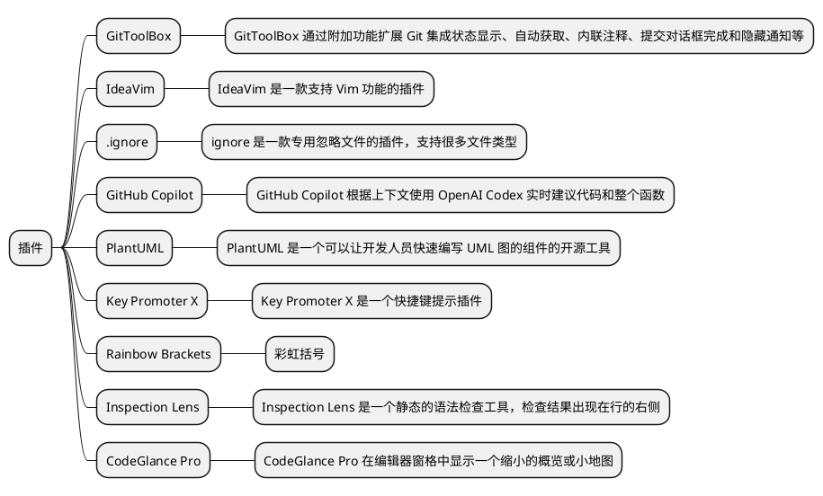

虽然 WebStorm 已经内置很多工具和插件供开发人员开箱即用，但是也支持安装插件扩展 WebStorm 的功能。
笔者根据自己使用插件的经验，向读者推荐下列插件

## [GitToolBox](https://plugins.jetbrains.com/plugin/7499-gittoolbox)

GitToolBox 通过附加功能扩展 Git 集成状态显示、自动获取、内联注释、提交对话框完成和隐藏通知等

- 每 15 分钟自动 fetch 当前分支代码
- Inline Blame 显示每行代码的提交信息
- 状态条右边显示当前的状态

## [IdeaVim](https://plugins.jetbrains.com/plugin/164-ideavim)

IdeaVim 是一款支持 Vim 功能的插件。IdeaVim 支持许多 Vim 功能，包括移动光标、搜索、复制和粘贴等功能，还可以通过`〜/.ideavimrc` 配置宏，窗口命令等

WebStorm 默认不支持 Vim 操作，若在 WebStorm 编辑器内使用 Vim 操作，可以通过 IdeaVim 插件实现。
Vim 详细操作请见 [Vim 操作](http://localhost:8888/guide/vim.html#%E6%99%AE%E9%80%9A%E6%A8%A1%E5%BC%8F)章节

## [.ignore](https://plugins.jetbrains.com/plugin/7495--ignore)

ignore 是一款专用忽略文件的插件，支持很多文件类型。常用的有 `.gitignore`、`.prettierignore`、`.styleignore`和 `.eslintignore` 等

## [GitHub Copilot](https://plugins.jetbrains.com/plugin/17718-github-copilot)

GitHub Copilot 根据上下文使用 OpenAI Codex 实时建议代码和整个函数。但是该服务收费，月付收费 `10$`，年付收费`100$`

## [PlantUML](https://plugins.jetbrains.com/plugin/7017-plantuml-integration)

UML 作为统一建模语言，主要用于业务沟通。而 PlantUML 是一个可以让开发人员快速编写 UML 图的组件的开源工具

常用的有时序图、活动图和 MindMap 等。下面演示 MindMap 图

由 plantUML 生成的思维导图如下

## [Key Promoter X](https://plugins.jetbrains.com/plugin/9792-key-promoter-x)

Key Promoter X 是一个快捷键提示插件，当你在 WebStorm 里面使用鼠标的时候，如果这个鼠标操作能够用快捷键替代的话，那么 Key Promoter X 会弹出一个提示框，告知你这个鼠标操作可以用什么快捷键替代

## [Rainbow Brackets](https://plugins.jetbrains.com/plugin/10080-rainbow-brackets)

彩虹括号按照颜色匹配括号，提高括号匹配速度，还可以高亮目标代码，快速锁定显示目标代码

## [Inspection Lens](https://plugins.jetbrains.com/plugin/19678-inspection-lens)

Inspection Lens 是一个静态的语法检查工具，检查结果出现在行的右侧。按照 `Errors`、`Warnings`、`Weak Warnings`、`Server Problems`、`Typos` 等级显示。如图所示 `Typos` 检查

## [CodeGlance Pro](https://plugins.jetbrains.com/plugin/18824-codeglance-pro)

CodeGlance Pro 在编辑器窗格中显示一个缩小的概览或小地图, 小地图允许快速滚动

## [any-rule](https://plugins.jetbrains.com/plugin/14162-any-rule)

正则大全

## [Translation](https://plugins.jetbrains.com/plugin/8579-translation)

Translation 是一个基于 IntelliJ IDE/Android Studio 的翻译插件。它集成了谷歌翻译、微软翻译、DeepL 翻译、有道翻译、百度翻译等众多翻译引擎，在你的 IDE 内随时对想要翻译的文本、代码注释、代码文档等进行翻译
