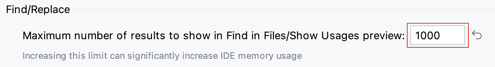

**搜索**是编辑器里非常非常重要的功能，可以帮开发人员快速定位变量或方法定义或使用位置

## Search Everywhere

Search Everywhere 即搜索所有，可以快速查找任何文件、类、操作、符号和分支等

双击 `shift`，显示 `Search Everywhere` 弹窗，如下图所示

- `All` - 可以搜索所有的文件、类、符号、操作和分支名，甚至是 WebStorm 的操作
- `Classes` - 搜索类
- `Files` - 搜索文件，支持文件路径搜索
- `Symbols` - 搜索变量、方法和类
- `Actions` - 搜索操作
- `Git` - 搜索本地或远程的分支

在搜索框内输入搜索内容，搜索结果实时更新，选择匹配的内容，点击跳转

## 项目窗口搜索

当光标聚焦在 Project 窗口上，直接输入内容唤起搜索输入框，搜索当前目录里的文件，并以高亮显示匹配结果。默认不搜索文件夹内的文件。
展开文件夹，会对文件夹内的文件进行匹配

比如我们查看 `node_modules` 里的 `prettier` package。搜索结果如图所示

但是当项目文件夹非常多，并且文件嵌套层级比较深时，Project 目录搜索的作用有限。此时笔者推荐下面提到的*查看最近的文件*功能

## 文件内搜索

光标选中要搜索的变量或方法，然后使用 `command + f` 快捷键

## 代码块内搜索

光标选中要搜索的变量或方法，然后使用 `command + f` 快捷键，可以匹配该文件里所有匹配的值

点击过滤按钮，弹出操作窗口

勾选 `Search In Selection` 选项，选择代码块，可以看到只会匹配代码块中的结果

## Find in Files

WebStorm 有搜索匹配数量限制（matches limit）。在大型项目中，变量或方法名匹配的数量可能超过默认数量（默认 100）限制，所有需要设置合理的搜索匹配数量

然后按照 `Peferences -> Advanced Settings`，找到 `Find/Replace` 配置项，设置合理的值。设置的值越大，IDE 占用的内存越大

光标选中要搜索的变量或方法，然后使用 `command + shift + f` 快捷键。WebStorm 会以弹框的形式呈现所有匹配的搜索结果

弹框的左上角显示搜索的变量或方法在项目中匹配的数量和匹配的文件数量

弹框的右上角可以通过正则表达式指明只在匹配的文件类型中搜索变量或方法

弹框内容区域上显示匹配的列表，下面显示匹配的变量或方法在文件中的详情

当项目的根目录中有 `dist` 目录时，WebStorm 默认在 dist 目录中匹配
然后，我们完全不用理会 dist 目录，可以通过 `Peferences -> Editor -> File Types -> Ignored Files and Folders` 忽略

## 文件路径搜索

WebStorm 支持文件路径搜索，匹配具体的文件

双击 `command + shift + o`，会弹出 `Files` 搜索弹窗，如下图所示

输入要搜索的文件路径，结果列表实时更新，使用 `up/down` 键选择文件，点击 `Enter` 键、即可跳转至选中的文件

## 查看最近的文件

按下 `command + e` 快捷键，WebStorm 会弹出项目导航窗口，如下图所示

该功能可以查看最近打开的文件，点击要打开的文件，即可跳转该文件。还可以勾选 `Show edited only`，只显示最近编辑过的文件。该功能也支持文件名搜索，如图所示

使用 `command + e` 快捷键后，直接输入搜索内容，弹窗左上角会显示搜索框，右边显示搜索结果，搜索结果实时更新，并以高亮显示匹配结果

如果根据文件名没有搜索到文件，可以使用 `command + shift + o` 快捷键调用 `Files` 搜索弹窗

在输入框里输入文件名搜索，搜索结果实时更新。该功能可以搜索所有的文件

## 查看最近的位置

按下 `command + shift + e` 快捷键，WebStorm 会弹出 `Recent Locations` 弹窗，如下图所示

点击代码块，跳转指定的编辑位置

## 搜索替换

搜索替换是对文件内匹配的变量进行替换。光标选中要搜索的变量、然后使用 `command + r` 快捷键，调出搜索替换工具条，如下图所示

在输入框里输入要替换的变量、点击 `Replace` 按钮，只会将光标聚焦的变量替换，点击 `Replace All` 按钮，即可把当前文件中所有匹配的内容全部替换

## Run Anything

使用 Run Anything，您可以快速启动运行配置和如 npm 和 Yarn 的工具，以及打开最近的项目

双击 `control` 键或点击导航栏右侧的图标，选择 `Run Anything...` 选项，会调出 `Run Anything` 弹窗

比如输入 `yarn`，WebStorm 会提示与 `yarn` 相关的命令，点击指定的命令即可运行命令
