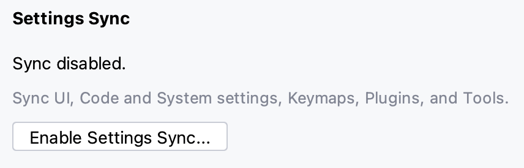
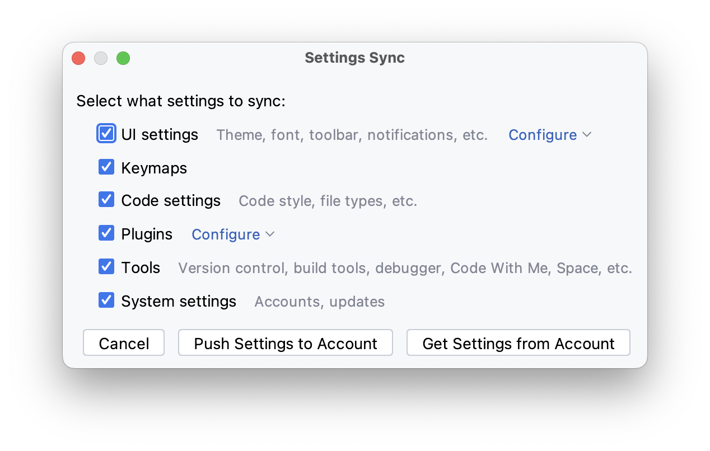

## 用户界面

用户界面定义项目工具窗口、编辑器、导航栏、状态条、上下文菜单和弹窗菜单等所有视觉元素的外观

### 导航栏

- **`1`** 是导航栏，主要提供一些便捷的操作。从左往右依次是查看项目当前分支、快速打开/切换项目、快速运行配置、`Code With Me`、`Search Everywhere` 和设置功能

### 状态条

- **`2`** 是状态条，可以查看文件的基本信息。比如面包屑、光标的位置和编码格式等等

### 项目工具窗口

- **`3`** 是项目工具窗口，用于管理项目文件

项目工具窗口有下列功能：

- `项目文件` - 当前的项目文件
- `External Libraries` - 用于存储下载的 `TypeScript` 定义文件或通过 `CDN` 链接引用的库，以及 `Node.js` 核心节点或任何自定义第三方库。
- `Scratches and Consoles` - 提供临时的文件编辑环境，开发人员可以写一些代码片段

### 编辑器

- **`4`** 是 WebStorm 的编辑器，编辑器是 IDE 的主要部分，用于创建、读取和修改代码

### 装订线

- **`5`** 是装订线，显示代码行号、书签和 Gutter 图标等等

## 语言选择

WebStorm 默认使用英文界面，但是也支持简体中文界面

需要开发人员先安装[简体中文语言包](https://plugins.jetbrains.com/plugin/13710-chinese-simplified-language-pack----)，该语言包是官方出品

安装成功后，`Restart` WebStorm 将显示简体中文界面

## 字体

### 外观字体

- 推荐使用 `.AppleSystemUIFont`，字体大小 `13`

### Font

- 推荐使用 `SF mono` 字体，字体大小 `18` 行高 `1.2`

#### [SF mono](https://www.cufonfonts.com/font/sf-mono)

英文等宽字体， 笔画清晰、可读性强

#### [Roboto mono](https://fonts.google.com/specimen/Roboto+Mono/about)

`Roboto Mono` 优化各种设备和屏幕阅读环境的可读性

#### [Fira Code](https://fonts.google.com/specimen/Fira+Code)

Fira 是 Mozilla 主推的字体系列，Fira Code 是基于 Fira Mono 等宽字体的一个扩展，主要特点是加入了编程连字特性

### Console Font

- 推荐使用 `Roboto mono` 字体，字体大小 `14` 行高 `1.0`

## 主题

WebStorm [插件市场](https://plugins.jetbrains.com/search?tags=Theme)提供很多主题插件，开发人员安装喜欢的主题插件，
下面笔者推荐一些还不错的主题

### light theme

#### [GitHub Light](https://plugins.jetbrains.com/plugin/15418-github-theme)

### dark theme

#### [GitHub Dark Dimmed](https://plugins.jetbrains.com/plugin/15418-github-theme)

#### [Darcula](https://plugins.jetbrains.com/plugin/15418-github-theme)

#### [Vuesion Theme](https://plugins.jetbrains.com/plugin/12226-vuesion-theme)

有时我们需要切换主题，点击 WebStorm 右上角的 <icons-Setting/> 图标，显示提示框，选择 `Theme...`选项，显示 Theme 弹框

点击主题，即可切换主题

## 图标

### [Atom Material File Icons](https://plugins.jetbrains.com/plugin/10044-atom-material-icons)

### [Extra Icons](https://plugins.jetbrains.com/plugin/11058-extra-icons)

该文件图标插件是付费插件

## 快捷键

使用快捷键可以提高开发效率。WebStorm 提供快捷键表方便开发人员使用。在 `Help -> Keyboard Shortcuts PDF`,
点击 `Keyboard Shortcuts PDF` 选项，即可下载快捷键 pdf 文件

如图所示，WebStorm 根据功能对快捷键进行分类

## 设置

### 内存大小

WebStorm 每次打开项目需要建立索引，当项目文件超级多时，WebStorm 的 CPU 和内存占用高，会出现较长时间的卡顿。我们通过修改它的默认内存配置，
提高 WebStorm 内存占用上限，缓解界面卡顿的问题，提升用户体验

按照 `Help -> Change Memory Settings`，点击 `Change Memory Settings` 选项，显示 `Memory Settings` 弹窗

根据电脑配置配置合理的内存大小，推荐使用 `4G（4096MiB）` 的内存大小，然后点击 `Save and Restart` 按钮让设置生效

### 代理

由于特殊原因，开发人员使用 WebStorm 插件市场或安装一些包时，会出来网络无法连接等问题。可以通过配置代理解决

<el-alert
title="前提是开发人员已有代理服务"
type="warning"
:closable='false'>
</el-alert>

### Settings Sync

在 `2022.3.2` 版本中，WebStorm 提供了同步设置的功能。可以将自己的配置通过账号同步到云端。可以同步的设置包括：IDE 主题、键盘映射、配色方案、系统设置、UI 设置、菜单和工具栏设置、项目视图设置、编辑器设置、代码完成设置、参数名称提示、实时模板、代码样式和列表启用和禁用的插件

使用 `command + ,` 快捷键，点击 `Settings Sync` 选项，如下图所示

点击 `Enable Settings Sync...` 按钮

勾选需要同步的内容，点击 `Push Settings to Account`，将配置上传到云上，或者点击 `Get Settings from Account` 按钮将云上的配置同步到项目上

### 其他

WebStorm 提供了丰富的功能，可以通过使用 `command + ,` 快捷键调出 `Preferences` 弹窗

在搜索框内输入功能名称，点击选择功能，右侧可以看到该功能的详情配置，根据使用情况调整配置，最后点击 `OK` 按钮让配置生效
